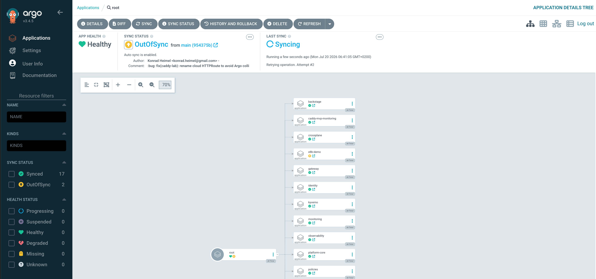
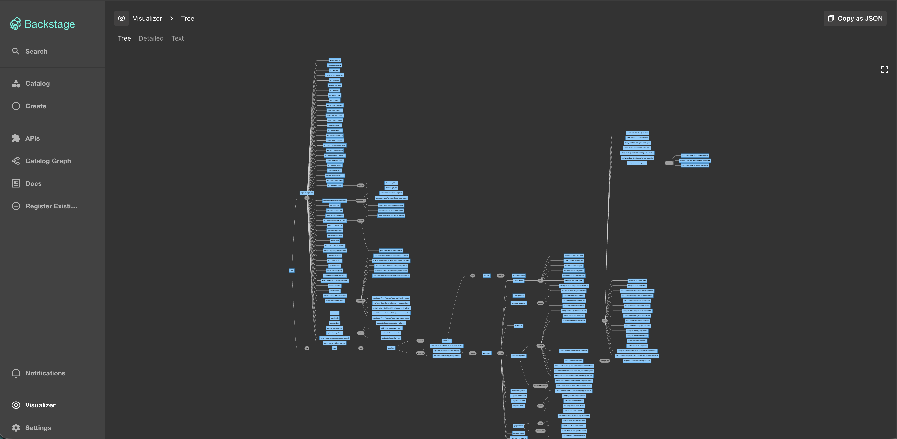
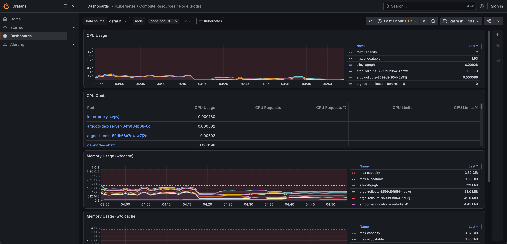
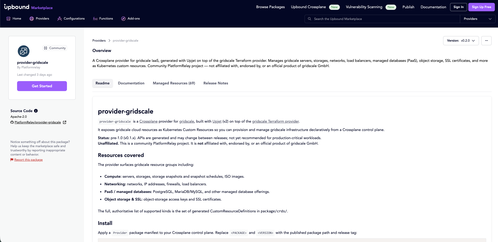

<!-- markdownlint-disable MD013 MD033 MD041 -->
# kaddy — a caddie for your websites

<p align="center">
  
</p>

<p align="center">
  <strong>Security-first · spec-driven · Kubernetes-native Website-as-a-Service</strong>
</p>

<p align="center">
  <a href="https://github.com/PlatformRelay/Kaddy/actions/workflows/verify.yaml"></a>
  <a href="https://github.com/PlatformRelay/Kaddy/actions/workflows/deck.yaml"></a>
  <a href="https://github.com/PlatformRelay/Kaddy/actions/workflows/chainsaw.yaml"></a>
  <a href="https://github.com/PlatformRelay/Kaddy/actions/workflows/trivy.yaml"></a>
  <a href="https://github.com/PlatformRelay/Kaddy/releases"></a>
  <a href="https://platformrelay.github.io/Kaddy/"></a>
  
  <a href="LICENSE"></a>
</p>

<!-- Badge caveats (REQ-E12c-S07-01): CI/deck/chainsaw/trivy badges map to real workflows
     on PlatformRelay/Kaddy. The docs/Pages badge points at the published GitHub Pages URL
     (E8-S03); it renders "pending" if Pages is down. LICENSE is MIT (Platform Relay). -->

kaddy is an internal developer platform for **monitored, TLS-terminated websites**. One
self-service claim provisions a site behind Caddy with observability, alerting, and
progressive delivery. The [gridscale Platform Engineer exercise](docs/HIRING_EXERCISE.md)
is satisfied as **one tenant** of the platform — `clubhouse` — not as a one-off VM script.

> **Pitch deck:** [Download from Releases](https://github.com/PlatformRelay/Kaddy/releases/latest/download/kaddy-deck.pdf)
> (`kaddy-deck.pdf` on the [latest release](https://github.com/PlatformRelay/Kaddy/releases/latest)).

## Table of contents

- [Live demo](#live-demo)
- [Getting Started](#getting-started)
- [Reviewer paths](#reviewer-paths)
- [Status](#status)
- [Stack](#stack)
- [Named components](#named-components-the-caddie-metaphor)
- [Repository layout](#repository-layout)
- [Ways to run](#ways-to-run)
- [Testing](#testing-mandatory-tdd)
- [Cloud & cost](#cloud--cost)
- [Documentation](#documentation)
- [Contributing](#contributing)

## Live demo

Public GSK cloud-edge with Let's Encrypt **prod** certs (DNS-01). On-demand / time-boxed
cost governance — URLs are live only while the edge is up
([runbook](docs/runbooks/gridscale-live-demo.md)).

| Surface | URL | Probe (2026-07-20) |
| --- | --- | --- |
| ✅ Argo CD | <https://argocd.lab.platformrelay.dev> | HTTPS **200** (UI) |
| ✅ Grafana | <https://grafana.lab.platformrelay.dev> | HTTPS **200** |
| ✅ Demo site | <https://demo.lab.platformrelay.dev> | HTTPS **200** |
| ✅ Caddy tenant | <https://caddy.lab.platformrelay.dev> | HTTPS **200** (HTTPRoute `caddy-lab`) |
| ✅ Portal | <https://portal.lab.platformrelay.dev> | HTTPS **200** (Backstage) |

### Showcase captures

Still captures shipped under [`slides/public/surfaces/`](slides/public/surfaces/) (used by the
deck; paths work on GitHub):

| Surface | Capture |
| --- | --- |
| Argo CD app-of-apps | <a href="slides/public/surfaces/argocd-app-of-apps.png"></a> |
| Backstage portal | <a href="slides/public/surfaces/backstage-portal.png"></a> |
| Grafana (node pods) | <a href="slides/public/surfaces/grafana-alerting.png"></a> |
| Upbound Marketplace | <a href="slides/public/surfaces/marketplace-listing.png"></a> |

Edge overlays: [`deploy/gateway-controller/traefik/`](deploy/gateway-controller/traefik/) ·
[`deploy/gateway/cloud-only/`](deploy/gateway/cloud-only/).

<details>
<summary>Caveats (honest)</summary>

- **Argo sync ≠ UI up.** The Argo CD UI can return 200 while individual apps (e.g. `backstage`)
  are OutOfSync / sync-failed under GSK MemoryPressure — do not claim cluster-wide Synced.
- Bring-up / teardown: `task e8b:up` → demo → `task e8b:down` (see the live-demo runbook).

</details>

## Getting Started

**Local path (kind + Cilium):** follow **[docs/getting-started.md](docs/getting-started.md)** —
`task cluster:up` → bootstrap → demos (`task demo:fire` / `task demo` / `task demo:chaos`).

| Doc | Why |
| --- | --- |
| [docs/getting-started.md](docs/getting-started.md) | Bring-up, service catalogue, demos |
| [docs/ARCHITECTURE.md](docs/ARCHITECTURE.md) | Components & security boundaries |
| [docs/ROADMAP.md](docs/ROADMAP.md) | Phases 0–2, epics E1–E14 |
| [docs/requirements/exercise-traceability.md](docs/requirements/exercise-traceability.md) | Brief → epic mapping |

> **Local-first:** phase 1 runs on **kind + Cilium**
> ([e1e-kind-local-cluster](openspec/changes/e1e-kind-local-cluster/), landed). Phase 2 promotes
> to **GSK + LBaaS + Upjet** — [ROADMAP](docs/ROADMAP.md).

## Reviewer paths

### Five-minute path

1. **Pitch deck** — [Download from Releases](https://github.com/PlatformRelay/Kaddy/releases)
   (deck Pages URL **unavailable** / not yet published as a static site).
2. **Scorecard** — [platformrelay.github.io/Kaddy](https://platformrelay.github.io/Kaddy/)
   (HTTP 200; [scorecard-pages](.github/workflows/scorecard-pages.yaml)).
3. **Local demos** — [docs/getting-started.md](docs/getting-started.md).
4. **Architecture** — [docs/ARCHITECTURE.md](docs/ARCHITECTURE.md) ·
   [exercise traceability](docs/requirements/exercise-traceability.md) ·
   [ROADMAP](docs/ROADMAP.md).

### Deep dive

[ADRs](docs/adr/README.md) → [ARCHITECTURE](docs/ARCHITECTURE.md) →
[openspec/changes/](openspec/changes/) (`Verify:` + `Test:` per requirement).

## Status

Brief answered end-to-end on kind + standing GSK lab edge: **serve → scrape → fire**, progressive
delivery, enforcing security baseline, GitOps. Releases: **[v0.1.0](https://github.com/PlatformRelay/Kaddy/releases/tag/v0.1.0)** … **[v0.9.1](https://github.com/PlatformRelay/Kaddy/releases/tag/v0.9.1)** (working GitHub sign-in gate — same-id override fix, /login redirect; operator-confirmed login).

| Area | State | Notes |
| --- | --- | --- |
| ✅ Phase 1 GitOps | Landed | App-of-apps Synced/Healthy on kind; clubhouse via Cilium Gateway (E4) |
| ✅ Observability | Landed | Prometheus / Alertmanager / Grafana + Loki / Alloy (E3); `task demo:fire` (E5) |
| ✅ Progressive delivery | Landed | Argo Rollouts + Gateway canary weights / auto-rollback (E7) |
| ✅ Security baseline | Landed | Kyverno Enforce, default-deny NetPol, restricted AppProjects (E1c) |
| ✅ Self-service | Landed | Crossplane `Website` XRD (E6); Dex + GitHub OAuth (E1d) |
| ✅ Caddy operator | Landed | Optional operator on `main` (after v0.1.1) |
| ✅ Showcase deck | Recording-ready | E12 / E12d — download from [Releases](https://github.com/PlatformRelay/Kaddy/releases) |
| ✅ GSK day-0 IaC | Offline + live-proven | Terramate stacks; E1g cluster proven then torn down / standing carve-out |
| ✅ Cloud edge | Live (time-boxed) | Traefik Gateway + LE on `*.lab.platformrelay.dev` |
| ✅ Portal (E10) | Live route | `portal.lab` HTTPS 200; NetPol selectors on `main` |
| ✅ Caddy lab route | Live | `caddy.lab` HTTPS 200 via HTTPRoute `caddy-lab` (no Argo name collision) |
| ✅ Grafana public | Live | `grafana.lab` HTTPS 200 |
| ⚠️ Argo app sync | Partial | UI up; some apps may be OutOfSync under MemoryPressure |
| ⚠️ E6g / E13 live | Cost-gated | Provider install + Marketplace deploy follow-ups |
| 🔒 Security review | Filed | [docs/security/security-review-2026-07-16.md](docs/security/security-review-2026-07-16.md) |

Full plan: [ROADMAP](docs/ROADMAP.md).

## Stack

| Layer | Phase 1 (kind — local) | Phase 2 (gridscale lab) |
| --- | --- | --- |
| Substrate | **kind + Cilium** ([E1e](openspec/changes/e1e-kind-local-cluster/)) | **GSK** managed k8s |
| Day-0 IaC | [`hack/cluster/`](hack/cluster/) | Terramate + [`stacks/gridscale/`](stacks/gridscale/) |
| Edge | **Cilium Gateway** + LB-IPAM/L2 | **Traefik** + LBaaS + LE ([`deploy/gateway/cloud-only/`](deploy/gateway/cloud-only/)) |
| GitOps | **Argo CD** [`deploy/apps/`](deploy/apps/) | Same manifests on GSK |
| Identity | Dex + GitHub OAuth | Same |
| Secrets | SOPS + age ([ADR-0110](docs/adr/0110-secrets-sops-age.md)) | Same |
| Observability | kube-prometheus-stack + Loki + Alloy | Same |
| Self-service | Crossplane `Website` XRD | + Upjet **provider-gridscale** ([E6g](openspec/changes/e6g-provider-gridscale/)) |
| Progressive delivery | Argo Rollouts + Gateway API | Same |
| Policy | Kyverno, NetworkPolicies | Same |

## Named components (the caddie metaphor)

| Component | Role |
| --- | --- |
| **clubhouse** | Sample website tenant (satisfies the brief) |
| **marshal** | Alerting pipeline — PrometheusRules + Alertmanager |
| **mulligan** | Blue/green + canary with automated rollback |
| **scorecard** | Evidence harness — k6 + metrics/logs → HTML report |
| **driving-range** | Deferred optional 3-node Talos spike (sibling repo; D-025) |

## Repository layout

```text
Kaddy/
├── deploy/                 # GitOps manifests (Argo app-of-apps)
│   ├── apps/               # Application CRs + AppProjects
│   ├── gateway/            # kind Gateway + cloud-only Traefik routes
│   ├── gateway-controller/ # Traefik (cloud) / Cilium edge controllers
│   ├── portal/             # Backstage IDP wiring (E10)
│   ├── workloads/          # clubhouse / caddy-mvp / demos
│   ├── crossplane/         # Website XRD + compositions
│   ├── monitoring/         # marshal rules, ServiceMonitors
│   └── policies/           # Kyverno + NetworkPolicies
├── stacks/                 # OpenTofu / Terramate (phase 2)
│   ├── gridscale/          # network · k8s (GSK) · lbaas · object-storage
│   └── gridscale-marketplace/  # caddy · nix Marketplace templates (E13/E14)
├── nix/                    # Flake + modules for Nix golden images (E14)
│   ├── flake.nix
│   └── caddy/ · srv/ · modules/
├── hack/
│   ├── cluster/            # kind bring-up (kind-up.sh, Cilium, Gateway API)
│   └── gsk/                # edge-up.sh, cert-manager, image rolls
├── packer/                 # Ubuntu Marketplace golden images
├── operator/               # Optional Caddy operator (Go)
├── slides/                 # Slidev interview deck sources
├── openspec/changes/       # Spec-driven change proposals
├── tests/                  # smoke · chainsaw · deck · meta gates
├── docs/                   # Architecture, ROADMAP, ADRs, getting-started
└── evidence/               # Scorecard + live proof notes
```

## Ways to run

| Path | Entry points |
| --- | --- |
| **kind (local)** | [`hack/cluster/kind/`](hack/cluster/kind/) · [`hack/cluster/kind-up.sh`](hack/cluster/kind-up.sh) · `task cluster:up` · [getting-started](docs/getting-started.md) |
| **GSK edge** | [`hack/gsk/edge-up.sh`](hack/gsk/edge-up.sh) · [`deploy/gateway/cloud-only/`](deploy/gateway/cloud-only/) · [live-demo runbook](docs/runbooks/gridscale-live-demo.md) |
| **OpenTofu / Terramate** | [`stacks/gridscale/`](stacks/gridscale/) · [`stacks/gridscale-marketplace/`](stacks/gridscale-marketplace/) · `config.tm.hcl` / `terramate.tm.hcl` |
| **Nix golden image** | [`nix/flake.nix`](nix/flake.nix) · [`nix/caddy/`](nix/caddy/) · [`.github/workflows/e14-nix-image.yaml`](.github/workflows/e14-nix-image.yaml) |
| **Packer (Ubuntu)** | [`packer/caddy.pkr.hcl`](packer/caddy.pkr.hcl) · [`packer/nginx.pkr.hcl`](packer/nginx.pkr.hcl) |
| **Argo GitOps** | [`deploy/apps/root.yaml`](deploy/apps/root.yaml) · [`deploy/apps/`](deploy/apps/) |
| **Portal** | [`deploy/portal/`](deploy/portal/) · companion [kaddy-portal](https://github.com/PlatformRelay/kaddy-portal) |

## Testing (mandatory TDD)

Every requirement carries a `Test:` artifact and a `Verify:` command — see
[docs/development/testing.md](docs/development/testing.md) and
[ADR-0701](docs/adr/0701-testing-strategy-chainsaw.md).

```bash
task verify         # lint + scrub + openspec + spec-coverage + meta smokes
task test:spec      # every REQ has Test + Verify
task test           # L0 tofu test · L1 conftest + promtool · L2 Chainsaw
```

| Level | Tool | Proves |
| --- | --- | --- |
| L0 | `tofu test` | Label module outputs |
| L1 | conftest · **promtool** | Plan labels · alert rules fire |
| L2 | **Chainsaw** | Policies, routes, rollouts, monitors on a live cluster |
| L3 / L4 | k6 · scorecard | Load / alerting · evidence bundle |

## Cloud & cost

**Phase 1** develops on kind ($0). **Phase 2** promotes to gridscale-native PaaS (GSK, LBaaS,
Object Storage, Upjet) for the employer-facing demo.

### Phase 2 monthly cost estimate (EUR)

Lab-sized footprint — **estimates** from public [gridscale pricing](https://gridscale.io/en/pricing/)
(control plane free; billed per minute). Re-check before quoting. Phase 1 is **€0 / month**.

| Resource | Size (typical lab) | Est. EUR / month |
| --- | --- | --- |
| GSK node pool | 4× 2C-4G workers (~€46/node; D-048 default 3, 4th operator-approved 2026-07-20) | ~184 |
| LBaaS | 1 load balancer | ~22.50 |
| Object Storage | evidence / marketplace `.gz` (per GB) | ~0.06 / GB |
| **Total (indicative, excl. storage GB)** | | **~207 EUR / month** |

## Documentation

| | Document |
| --- | --- |
| 🎯 | [Getting Started](docs/getting-started.md) · [ROADMAP](docs/ROADMAP.md) · [exercise traceability](docs/requirements/exercise-traceability.md) |
| 🏗️ | [ARCHITECTURE](docs/ARCHITECTURE.md) · [ADRs](docs/adr/README.md) |
| 📋 | [DEVELOPMENT](docs/development/DEVELOPMENT.md) · [testing](docs/development/testing.md) · [skills](skills/README.md) |
| 🔒 | [Audits](docs/audits/README.md) · [security review](docs/security/security-review-2026-07-16.md) |
| 🎬 | [Slides](slides/README.md) · [Releases (deck)](https://github.com/PlatformRelay/Kaddy/releases) |
| 📊 | [Evidence / scorecard](evidence/README.md) |

<details>
<summary>Reference material (gitignored locally)</summary>

[`references/PocketIDP/`](references/PocketIDP/) is a local, un-vendored copy of
[PocketIDP](https://github.com/InternalDeveloperPlatform/PocketIDP) (Gitea + Backstage patterns
for E10). Not part of the committed tree.

</details>

## Contributing

- Gates: `task verify` (see [DEVELOPMENT](docs/development/DEVELOPMENT.md)).
- Commits: `:gitmoji: <type>(scope): summary` — ASCII shortcode, no Unicode emoji in the subject.
- Spec-driven lanes reference an OpenSpec change under [`openspec/changes/`](openspec/changes/).
- Deck sources live in [`slides/`](slides/); prefer consuming the published deck from
  [Releases](https://github.com/PlatformRelay/Kaddy/releases) rather than rebuilding locally.
