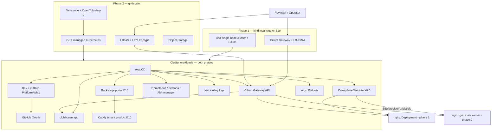

# Architecture — kaddy

## Phases

| Phase | Substrate | Edge | See |
| --- | --- | --- | --- |
| **1 · kind (local)** | Local **kind + Cilium** ([E1e](../openspec/changes/e1e-kind-local-cluster/), landed) — single control-plane node | **Cilium Gateway** + LB-IPAM/L2 | Now — $0 cloud |
| **2 · gridscale lab** | GSK managed k8s | LBaaS + Let's Encrypt | After E3–E7 green locally |

**Substrate reality (D-025).** Phase 1 develops on a local **kind** cluster (`kaddy-dev`,
Kubernetes v1.33.1) running **Cilium 1.18** (CNI + Gateway API + LB-IPAM/L2, kube-proxy replacement),
`cert-manager` v1.18.2 with a self-signed `kaddy-local-ca` issuer, and the built-in local-path
StorageClass. The landed cluster is a **single control-plane node** with the Cilium operator forced to
`replicas=1` — **no HA is exercised locally**; multi-node/HA is a phase-2 (GSK) concern. The LB pool is
carved from the docker `kind` bridge subnet, and because that subnet is not host-routable on macOS,
Gateway/LB IPs are asserted **assigned** (never host-curled) and HTTP smoke goes through loopback-bound
`extraPortMappings`. The 3-node Talos [driving-range](../../driving-range/) that originally motivated the
"local Talos" narrative is a **deferred optional maturity-contrast spike** (D-025), not the landed
substrate.

## System context (phase 2 target)

## Trust boundaries

| Boundary | Phase 1 | Phase 2 |
| --- | --- | --- |
| Entry → platform | Cilium LB-IPAM/L2 + cert-manager | LBaaS L7 + LE + cert-manager |
| Platform login | Dex → GitHub OAuth ([PlatformRelay](https://github.com/PlatformRelay)) | Same (public Dex issuer on LBaaS) |
| Secrets | SOPS + age in git ([ADR-0110](adr/0110-secrets-sops-age.md)) | Same |
| Crossplane → cloud | N/A (XRD only) | gridscale API via SOPS/ProviderConfig |
| Remote access | Local host (kind on loopback) | gridscale public LBaaS |

## Label flow

Terramate injects `modules/labels` → gridscale `labels` (phase 2 stacks only). GitOps manifests
carry the full mandatory set including `track` on Rollout pods in both phases.

See [ADR-0301](adr/0301-resource-labeling-convention.md).

## Component map

| Component | Brand name | Epic |
| --- | --- | --- |
| Evidence harness | scorecard | E8 |
| Rollouts demo | mulligan | E7 |
| Alert pipeline | marshal | E5 |
| Sample site | clubhouse | E4 |
| Local kind substrate | kind + Cilium | E1e (landed) |
| Deferred Talos spike | driving-range | optional maturity-contrast (D-025) |
| Tenant Caddy (brief) | Backstage scaffold | [e-caddy-mvp](../openspec/changes/e-caddy-mvp/) (ADR-0104) |

**Platform ingress is Cilium Gateway API** — not Caddy. Caddy satisfies the hiring brief as a **tenant**
product scaffolded via Backstage (ADR-0104, D-019).

**E8 scorecard evidence (honest status).** The landed gate is the **offline fixture path**:
`task test:scorecard` (capture from `evidence/fixtures/` + schema validate). Live k6 / cluster
capture is deferred. A GitHub Pages workflow exists (`.github/workflows/scorecard-pages.yaml`) and
publishes fixture-built HTML. Details: [testing.md](development/testing.md) · [ADR-0202](adr/0202-evidence-as-artifact.md).
