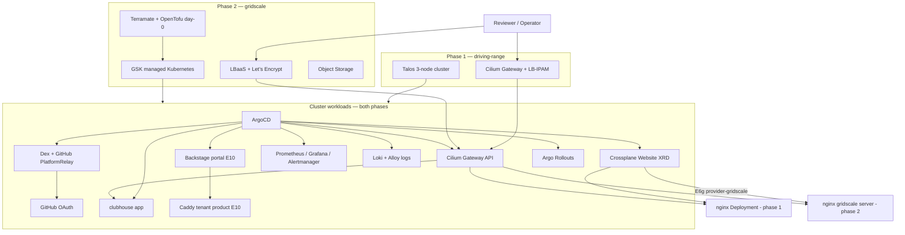

# Architecture — kaddy

## Phases

| Phase | Substrate | Edge | See |
| --- | --- | --- | --- |
| **1 · driving-range** | Local 3-node Talos ([driving-range](../../driving-range/)) | **Cilium Gateway** + LB-IPAM/L2 | Now — $0 cloud |
| **2 · gridscale lab** | GSK managed k8s | LBaaS + Let's Encrypt | After E3–E7 green locally |

## System context (phase 2 target)

## Trust boundaries

| Boundary | Phase 1 | Phase 2 |
| --- | --- | --- |
| Entry → platform | Cilium LB-IPAM/L2 + cert-manager | LBaaS L7 + LE + cert-manager |
| Platform login | Dex → GitHub OAuth ([PlatformRelay](https://github.com/PlatformRelay)) | Same (public Dex issuer on LBaaS) |
| Secrets | SOPS + age in git ([ADR-0110](adr/0110-secrets-sops-age.md)) | Same |
| Crossplane → cloud | N/A (XRD only) | gridscale API via SOPS/ProviderConfig |
| Remote access | Tailscale to driving-range host | gridscale public LBaaS |

## Label flow

Terramate injects `modules/labels` → gridscale `labels` (phase 2 stacks only). GitOps manifests
carry the full mandatory set including `track` on Rollout pods in both phases.

See [ADR-0301](adr/0301-resource-labeling-convention.md).

## Component map

| Component | Brand name | Epic |
| --- | --- | --- |
| Evidence harness | scorecard | E8 |
| Rollouts demo | mulligan | E7 |
| Alert pipeline | marshal | E5 |
| Sample site | clubhouse | E4 |
| Local Talos cluster | driving-range | phase 0 (sibling repo) |
| Tenant Caddy (brief) | Backstage scaffold | E10 (optional) |

**Platform ingress is Cilium Gateway API** — not Caddy. Caddy satisfies the hiring brief as a **tenant**
product scaffolded via Backstage (ADR-0104, D-019).
