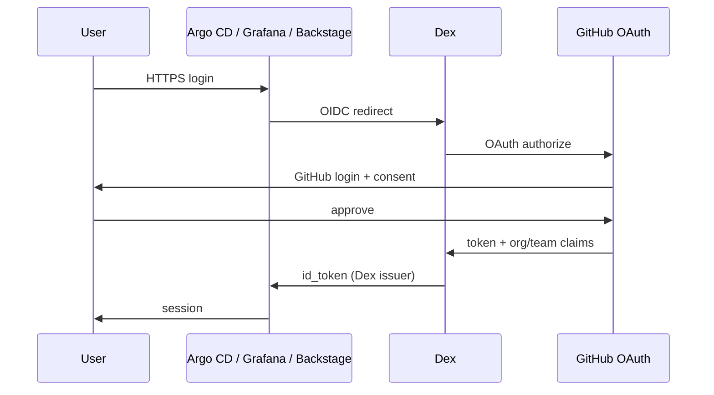

# ADR-0107: Identity — Dex OIDC with GitHub connector

**Theme:** 01 · Foundations · **Status:** Current · **Supersedes:** Keycloak + Dex (D-018)

## Context

kaddy is **security-first**. Argo CD, Grafana, and Backstage must not be anonymously reachable on a
public LoadBalancer IP. The gridscale brief does not mandate SSO, but interview reviewers expect
**authenticated control planes**.

Options considered:

| Option | Pros | Cons |
| --- | --- | --- |
| Keycloak + Dex | Full local IdP; group management in UI | Two components; Postgres dependency |
| Keycloak only | One IdP | Each app configures OIDC separately |
| **Dex + GitHub connector** | One OIDC issuer; no user DB to run; real login flow | Needs GitHub OAuth app; ties lab to GitHub org |
| Dex + staticPasswords | Minimal | Weak demo signal |

## Decision

Deploy **Dex** as the **cluster OIDC issuer** with a **GitHub connector** as the upstream identity
source. Platform apps (Argo CD, Grafana, Backstage) trust Dex only — not GitHub directly.

### Dex

- Namespace: `identity`.
- Issuer URL: `https://dex.platformrelay.dev/` (TLS via Gateway + cert-manager or LBaaS LE in phase 2).
- Connector: `type: github` — org **`PlatformRelay`** ([github.com/PlatformRelay](https://github.com/PlatformRelay)); team allowlist for lab access.
- Static clients for Argo CD, Grafana, Backstage (OAuth client secret via **SOPS** in git — [ADR-0110](0110-secrets-sops-age.md)).
- Group claims: map GitHub teams → `platform-admins`, `platform-readonly` for Argo CD RBAC.

### GitHub OAuth app (operator)

- **Callback URL:** `https://dex.platformrelay.dev/callback` (registered).
- **`.envrc`:** `GITHUB_APP_CLIENT_ID`, `GITHUB_APP_CLIENT_SECRET` — for local `sops -e` only; see [github-oauth-dex.md](../runbooks/github-oauth-dex.md).
- Cluster Secret `dex-github-oauth` from **`deploy/secrets/identity/dex-github.enc.yaml`** (KSOPS) — never plaintext in git.

### Consumers (minimum)

| App | Config | RBAC |
| --- | --- | --- |
| Argo CD | `oidc.config` → Dex issuer | `platform-admins` → admin; `platform-readonly` → read-only |
| Grafana | `auth.generic_oauth` → Dex | Admin vs Viewer via group claim |
| Backstage (E10) | `auth.providers.oidc` → Dex | Same pattern |

**Out of scope:** Kubernetes API `oidc-*` apiserver flags; Keycloak / local user DB.

### Security controls

- Default-deny NetworkPolicy in `identity` (ADR-0106); allow gateway → Dex:5556, apps → Dex.
- Mandatory labels on Dex workloads (ADR-0301).
- No OAuth secrets in Git; Trivy scan on Dex image (ADR-0106).
- Chainsaw suite proves unauthenticated Argo CD API returns 401/redirect to OIDC.

## Consequences

- **E1d** simplified: no Keycloak, no Postgres for identity — one Deployment, smaller blast radius.
- E1g drops Keycloak-on-`gridscale_postgresql` story (identity unchanged across phases).
- OIDC cutover: bootstrap admin → GitOps Dex → patch Argo CD / Grafana ConfigMaps.
- CI `kind` profile may skip Dex + mock OIDC for subset tests (ADR-0701).

## Counterpoints

- Lab depends on GitHub availability and operator's org membership — acceptable for a personal hiring exercise.
- Keycloak gave a stronger “we run our own IdP” signal — rejected for ops simplicity (D-018).

## References

- [Dex GitHub connector](https://dexidp.io/docs/connectors/github/)
- [Argo CD OIDC](https://argo-cd.readthedocs.io/en/stable/operator-manual/user-management/#existing-oidc-provider)
