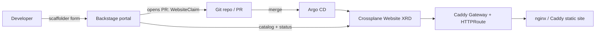

# ADR-0109: IDP portal & orchestrator

**Theme:** 01 · Foundations · **Status:** Proposed (operator decision D-014 open)

## Context

kaddy already exposes **self-service** through a Crossplane `Website` XRD (E6): apply a `WebsiteClaim`
and get an HTTPRoute + monitoring + (optional) nginx VM. The operator wants to grow this into a
**fully-fledged Internal Developer Platform (IDP)** — a portal where a user bootstraps **nginx** and
**Caddy static sites** without writing manifests.

The 2026 IDP landscape splits into **two complementary layers** (not competing):

| Layer | Job | OSS / self-hosted | Commercial SaaS |
| --- | --- | --- | --- |
| **Orchestrator** | Translate "what I need" → provisioned infra | **Crossplane**, **Kratix** | Humanitec (Score) |
| **Portal** | UI: catalog, docs, self-service actions | **Backstage** | Port, Cortex, OpsLevel |

kaddy's ethos (security-first, self-hosted, GitOps, no SaaS lock-in, already invested in Crossplane)
points hard at the **OSS/self-hosted** column.

## Decision (recommended — pending D-014)

**Orchestrator = Crossplane (keep).** The `Website` XRD *is* the platform API. Extend it, don't
replace it. Optionally adopt the **Score** spec (CNCF) as the user-facing workload description, mapped
to the XRD via `score-k8s` / a composition — gives a portable, tool-neutral input.

**Portal = Backstage (phased, scoped).** Add a Backstage instance with:

- **Software Catalog** — registers each `Website` and platform component.
- **Scaffolder template** — "New static site (nginx | Caddy)" form → opens a GitOps PR that adds a
  `WebsiteClaim` (PR-based, so it stays auditable and GitOps-native).
- **Crossplane / Kubernetes plugin** — shows claim + composed resource status in the UI.
- **TechDocs** — renders `docs/` (mkdocs already configured).
- **OIDC via Dex + GitHub** (ADR-0107) — no anonymous portal.

**Rejected for the lab:**

- **Humanitec / Port (SaaS):** cost, external dependency, and weaker "we built the control plane"
  interview signal. Recorded as the *buy* alternative if this were a real org.
- **Kratix as the orchestrator:** strong K8s-native option, but adds a second control-plane paradigm
  (Promises) on top of Crossplane we already run — only revisit if multi-cluster scheduling is needed.

## Flow (target)

## Adversarial note (scope)

A full Backstage build is a **2–4 FTE** commitment in production — real scope creep for a hiring
exercise. Two guards:

1. **Orchestrator-first value:** E6 (Crossplane XRD) already satisfies "bootstrap nginx/Caddy sites"
   via `kubectl`/GitOps. The portal is *experience*, not *capability* — it is genuinely optional (E10,
   cuttable).
2. **Phased portal:** ship the single scaffolder template + catalog + OIDC before any custom plugins.

## Managed-services option (resolved: D-013 / D-015)

Substrate is now **gridscale-native**: **GSK** managed Kubernetes + **LBaaS** (Let's Encrypt), which
frees effort for the platform/portal layer. Self-managed Talos-on-gridscale is kept as the cuttable
E0 contrast (weaker "built-it-ourselves" trade-off accepted per D-015). Only the *portal* stack
(Backstage vs Port vs Kratix) remains open in D-014.

## Testing

- Backstage scaffolder template: unit test the generated `WebsiteClaim` (golden file) — L1.
- Catalog + Crossplane plugin: Chainsaw asserts a scaffolded claim reconciles end-to-end — L2.
- OIDC: portal unauthenticated request redirects to Dex (reuse E1d pattern) — L2.

## References

- [Backstage](https://backstage.io/docs/overview/what-is-backstage) · [software templates](https://backstage.io/docs/features/software-templates/)
- [Crossplane composition](https://docs.crossplane.io/latest/concepts/compositions/)
- [Score](https://score.dev/) · [Kratix](https://kratix.io/) · [Humanitec vs Kratix](https://developer.humanitec.com/app-humanitec-io/docs/humanitec-vs-others/kratix-etc./)
