# Design — E13 gridscale Marketplace template (Caddy + nginx)

## Pipeline (build → export → publish → import → deploy)

```mermaid
flowchart LR
  build["Golden image build<br/>(Packer: Caddy/nginx + sample page + /metrics)"]
  snap["Storage snapshot"]
  export["Export snapshot → .gz<br/>object-storage bucket (s3://)"]
  app["gridscale_marketplace_application<br/>(metadata + icon → unique_hash)"]
  imp["gridscale_marketplace_application_import<br/>(unique_hash → tenant)"]
  server["gridscale_server from template<br/>(deploy proof)"]
  scrape["marshal: Prometheus scrapes /metrics<br/>→ caddy_* alert fires"]
  build --> snap --> export --> app --> imp --> server --> scrape
```



Two engines: a **Caddy** template and a mirrored **nginx** template, from one parameterised module.

## Layout

```
stacks/gridscale-marketplace/          # Terramate stack (phase 2; gated on E1g)
  caddy/                               # marketplace app: Caddy
  nginx/                               # marketplace app: nginx (mirror)
modules/marketplace-template/          # reusable: register + import + deploy-proof
  main.tf variables.tf outputs.tf
  tests/                               # tofu test fixtures (L0, offline)
packer/                                # golden-image build (Caddy/nginx + /metrics)
  caddy.pkr.hcl  nginx.pkr.hcl
assets/marketplace/icon.png            # meta_icon source (base64 at plan time)
tests/smoke/                           # live gridscale-API smoke (gated on E1g creds)
  e13-s02-register.sh  e13-s03-deploy.sh
tests/promtool/gridscale-marketplace.test.yaml   # caddy_* fires against the deployed VM (L1)
```

## Test levels (gridscale API — no k8s cluster)

This epic runs against the **gridscale cloud API + VMs**, not a Kubernetes cluster, so **L2 Chainsaw
does not apply**. Levels used: **L0** (`tofu test`/`validate`/`fmt` on `modules/marketplace-template`,
offline), **L1** (`promtool` for the `caddy_*` alert), and **live smoke scripts** under `tests/smoke/`
(gated on E1g credits, mirroring the E6/E6g gridscale smoke pattern). Live smoke REQs are tagged **L0**
in the sense that Terraform provisions and the script asserts — they are the integration proof, gated.

## Golden-image build

- **Preferred: Packer** (`gridscale` builder, per the gridscale Packer tutorial) — reproducible,
  version-pinned, diffable; the image installs Caddy/nginx, drops the sample page, and enables a
  `/metrics` endpoint (Caddy `metrics`; nginx via `nginx-prometheus-exporter`).
- **Fallback: manual snapshot** — provision a `gridscale_server`, configure by hand, snapshot. Kept as
  the time-box escape hatch (same posture as E6g's Upjet-vs-plain-TF fallback).

## Publish flow (private tenant, no global approval)

```terraform
resource "gridscale_marketplace_application" "caddy" {
  name                   = "kaddy-caddy-web"
  object_storage_path    = "s3://${var.bucket}/caddy-golden.gz"   # exported snapshot (.gz)
  category               = "Adminpanel"     # enum has no "Web Server"; real class in meta_*
  setup_cores            = 1
  setup_memory           = 1
  setup_storage_capacity = 10
  meta_os                = "Ubuntu 24.04"
  meta_components        = "Caddy, Prometheus node/metrics endpoint"
  meta_overview          = "Monitored, TLS-ready Caddy web server — serve a page, scrape, alert."
  meta_icon              = filebase64("../assets/marketplace/icon.png")
}

resource "gridscale_marketplace_application_import" "caddy" {
  import_unique_hash = gridscale_marketplace_application.caddy.unique_hash
}
```

Public listing is intentionally **not** requested (`is_publish_*` remain false) — it needs gridscale's
manual review (`product@gridscale.io`). Importing by `unique_hash` makes the template deployable within
our tenant, which satisfies the demo.

## Deploy proof → marshal

A `gridscale_server` created from the imported template must serve the sample page (HTTP 200) and expose
`/metrics`; in-cluster/agent Prometheus scrapes it and the parked `caddy_*` marshal alerts (D-026) fire
against this **real gridscale target** — the same serve→scrape→fire spine as E-Caddy-MVP Variant A,
delivered as a Marketplace product.

## Relationship to other epics

- **E-Caddy-MVP** owns the Caddy/nginx config + content; E13 packages it into a Marketplace image. The
  three ways: Variant B (K8s), Variant A / E6g (Crossplane VM), **E13 (Marketplace template)**.
- **E1g** provides the object-storage bucket + provider creds this epic requires.
- **E5 / marshal** provides the alerts the deployed server feeds.
