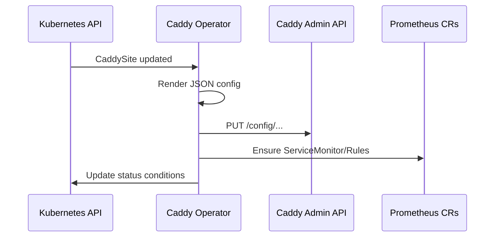

# Design — Caddy operator

## CRD: Caddy

```yaml
apiVersion: gateway.kaddy.io/v1alpha1
kind: Caddy
metadata:
  name: edge
  labels:
    app.kubernetes.io/name: caddy
    app.kubernetes.io/part-of: kaddy
spec:
  replicas: 2
  gatewayClassName: caddy
  metrics:
    enabled: true
  admin:
    listen: ":2019"
status:
  conditions:
    - type: Ready
```

## CRD: CaddySite

```yaml
apiVersion: gateway.kaddy.io/v1alpha1
kind: CaddySite
metadata:
  name: clubhouse
spec:
  caddyRef: edge
  hosts: ["demo.example.com"]
  routes:
    - path: /
      backend:
        serviceName: clubhouse
        port: 8080
  observability:
    prometheusRules: true
    serviceMonitor: true
    grafanaDashboard: true
```

## Reconcile loop



## Testing strategy (future E9)

- envtest: reconcile without real Caddy (mock Admin API)
- Contract tests for generated PrometheusRule labels (owner, service)

## Non-goals v1

- Replace Gateway API controller entirely
- Multi-tenant hard isolation
