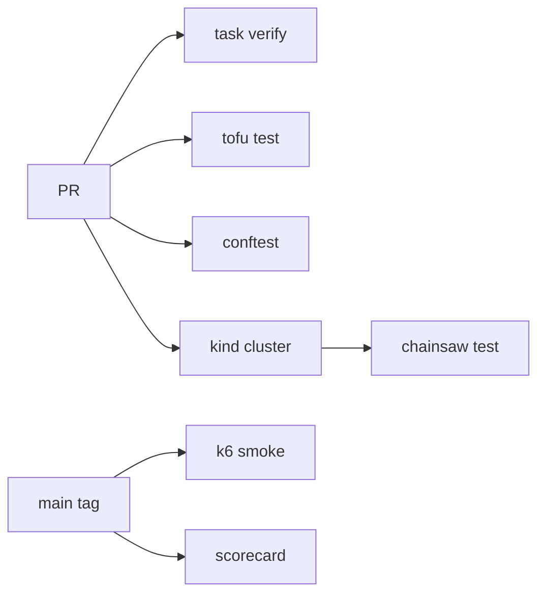

# Design — testing foundation

## CI topology



## kind cluster for L2

- `hack/kind/kaddy-ci.yaml` — 1 control plane, 1 worker (E3+)
- Pre-load: Gateway API CRDs, Kyverno, then sync platform apps under test
- Namespace per suite: `chainsaw-<suite>-<run-id>`

## Chainsaw config (`.chainsaw.yaml`)

```yaml
apiVersion: chainsaw.kyverno.io/v1alpha1
kind: Configuration
metadata:
  name: kaddy
spec:
  timeouts:
    apply: 30s
    assert: 60s
  cleanup: true
```

## TDD workflow per lane

1. Add REQ to epic spec with `Verify:` block
2. Add failing Chainsaw/tofu/k6 test
3. Implement manifest/module
4. Green gates → PR
