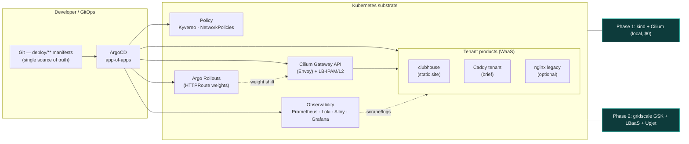
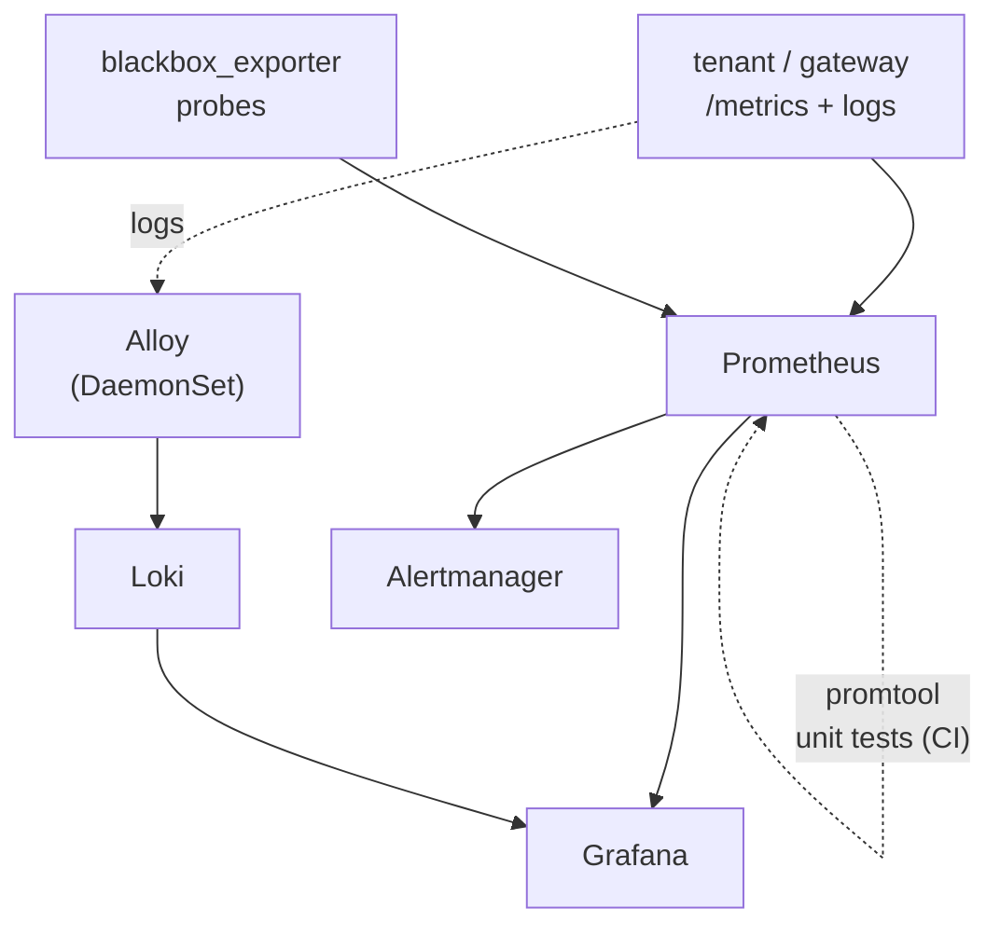
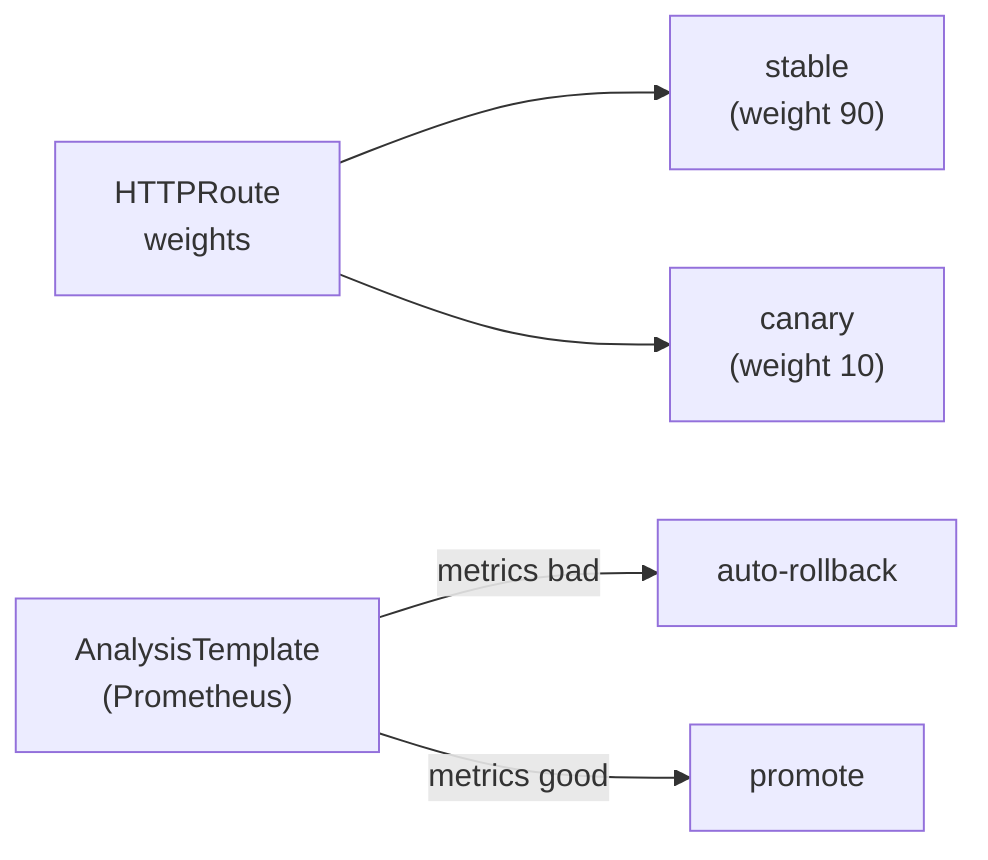

<!-- markdownlint-disable MD025 MD041 MD033 MD024 MD013 MD036 MD001 MD003 MD022 MD023 -->
---
theme: seriph
title: kaddy — Website-as-a-Service
info: |
  ## kaddy — a caddie for your websites
  Security-first, spec-driven, Kubernetes-native Website-as-a-Service.
  Built for the gridscale Platform Engineer exercise.
layout: none
transition: slide-left
mdc: true
---

<!--
Section covers (E12b): every <CoverArt> `src` already points at the FINAL
artwork filename under slides/public/covers/ (prompts + name map live in
slides/image-prompts.md). Until a PNG is generated and dropped in, CoverArt
falls back to covers/placeholder-section.svg — no code change needed later.
The low-opacity "AI generated" footer it renders is a mandatory guardrail.
-->

<CoverArt
  src="/covers/section-00-first-tee.png"
  kicker="§ 00 · The first tee"
  title="kaddy — a caddie for your websites"
/>

---
layout: cover
class: text-center
---

# kaddy

## A caddie for your websites

Security-first · spec-driven · Kubernetes-native **Website-as-a-Service**

<div class="pt-8 opacity-70 text-sm">
gridscale Platform Engineer exercise — platform engineering showcase
</div>

<div class="abs-br m-6 text-xs opacity-50">
github.com/PlatformRelay/Kaddy
</div>

<!--
Speaker: The brief says "install Caddy, serve a page, monitor it, alert on it."
I could have written a bash script on a VM. Instead I built the platform that
script would be one tenant of — and I did it spec-first, secured, and gated.
That is the story this deck tells.
-->

---
layout: none
---

<CoverArt
  src="/covers/section-01-one-line-letter.png"
  kicker="§ 01 · The one-line letter"
  title="The brief, reframed"
/>

---
layout: statement
---

# The brief, reframed

*"Install Caddy on a Linux VM, serve a page, scrape it with Prometheus, fire an alert."*

<div class="pt-6 text-xl opacity-80">

A one-off VM script answers the letter of the exercise.

It does **not** answer the question a platform team is actually asking:

</div>

<div class="pt-4 text-2xl font-bold text-teal-400">
How do you run monitored, TLS-terminated websites as a repeatable, governed product?
</div>

<!--
The exercise is a proxy for "can you build and operate a platform." So I treated
the Caddy-on-a-VM task as ONE tenant of a Website-as-a-Service platform —
"clubhouse" — rather than the whole deliverable.
-->

---
layout: none
---

<CoverArt
  src="/covers/section-02-one-hole-whole-course.png"
  kicker="§ 02 · One hole, whole course"
  title="From task to platform"
/>

---
layout: two-cols
layoutClass: gap-8
---

# From task to platform

**The exercise as one tenant**

The named subject — install Caddy, serve, scrape, alert — is satisfied as a
single **Website-as-a-Service** tenant (`clubhouse`), reached *through* the
platform edge, not as a bespoke script.

- One self-service **claim** → a monitored, TLS-terminated site
- Observability, alerting, and progressive delivery are platform features every
  tenant inherits — not per-site glue
- The brief's optional nginx reverse-proxy is the same shape: a second tenant

::right::

<div class="pt-14">

## The caddie metaphor

| Component | Role |
| --- | --- |
| **clubhouse** | the sample website tenant (the brief) |
| **marshal** | alerting — PrometheusRules + Alertmanager |
| **mulligan** | blue/green + canary with auto-rollback |
| **scorecard** | k6 + metrics/logs → HTML evidence report |

</div>

<!--
Naming is not decoration: each name maps to a capability and a directory. It
keeps incident conversations precise — "marshal is firing" beats "the alert thing."
-->

---
layout: none
---

<CoverArt
  src="/covers/section-03-honest-scorecard.png"
  kicker="§ 03 · The honest scorecard"
  title="What is actually landed vs designed"
/>

---
layout: statement
---

# What is actually landed vs designed

<div class="text-left max-w-3xl mx-auto pt-4 text-lg">

I am going to be precise about this, because a senior audience will check.

</div>

<div class="grid grid-cols-2 gap-6 pt-6 text-left max-w-4xl mx-auto">

<div class="p-4 rounded border border-green-600">

### ✅ Landed & gated on `main`

- **kind + Cilium** substrate (E1e)
- **labels** module + `tofu test` + conftest + Kyverno policy (E1b)
- **marshal** alert rules + **promtool** unit tests (E5)
- **CI gates** — gitleaks, conftest, tofu test, pinned installs
- **E2 gateway spike** proven (read-only)

</div>

<div class="p-4 rounded border border-amber-600">

### 🧭 Designed — specs + manifests, not yet running

- ArgoCD app-of-apps **sync**
- Observability spine **deployed** (Prometheus / Loki / Alloy / Grafana)
- cert-manager Let's Encrypt at the edge
- Crossplane `Website` XRD, Argo Rollouts
- Dex OIDC · Caddy-MVP tenant

</div>

</div>

<div class="pt-6 text-center text-teal-400">
Phase 1 is a $0 local cluster. The maturity is in the artifacts — ADRs, specs, real manifests, enforced policy, tested alerts, gated CI.
</div>

<!--
This is the single most important slide for credibility. Everything I claim as
"running" I can defend; everything else I call designed. That honesty IS the
senior signal.
-->

---
layout: none
---

<CoverArt
  src="/covers/section-04-two-courses-one-blueprint.png"
  kicker="§ 04 · Two courses, one blueprint"
  title="Architecture — two phases, one set of manifests"
/>

---
layout: default
---

# Architecture — two phases, one set of manifests



<div class="text-sm opacity-75 pt-2">

Same GitOps manifests target both substrates. Phase 1 (**kind + Cilium**, landed) is where the platform is developed; Phase 2 (**gridscale GSK**) re-syncs the identical apps behind LBaaS — deferred until Phase 1 is green. See `docs/ARCHITECTURE.md`, ADR-0102 (D-025), ADR-0104.

</div>

<!--
Key point: portability. I did not write one thing for local and another for
gridscale. The edge (Cilium Gateway API) matches so phase 2 is a re-sync, not a
rewrite. Caddy is a tenant reached THROUGH the edge, never the edge itself.
-->

---
layout: none
---

<CoverArt
  src="/covers/section-05-practice-green.png"
  kicker="§ 05 · The practice green"
  title="Substrate — local kind + Cilium"
/>

---
layout: two-cols
layoutClass: gap-8
---

# Substrate — local kind + Cilium

**Phase 1 dev cluster (E1e — landed, gated)**

- `kind` cluster `kaddy-dev`, Kubernetes **v1.33.1**, single control-plane node
- **Cilium 1.18** — CNI, **kube-proxy replacement**, operator pinned
- **Gateway API** + **LB-IPAM / L2** — no MetalLB, no host-network hacks
- **cert-manager v1.18.2** + self-signed `kaddy-local-ca` issuer
- macOS-safe: Gateway/LB IPs asserted assigned; HTTP smoke via loopback port-maps
- Secure install: **pinned versions, no `:latest`, no secrets in git**

::right::

<div class="pt-14">

## Why this, not MetalLB

The edge on kind (**Cilium Gateway API + LB-IPAM/L2**) is the *same shape* as
gridscale Phase 2 (Cilium is GSK's default CNI; LBaaS fronts the same Gateway).

So the local cluster is a faithful rehearsal, not a toy — the promotion to
gridscale is a re-point, not a re-architecture.

<div class="pt-4 text-sm opacity-70">

The 3-node Talos **driving-range** was deferred to an optional maturity-contrast
spike (D-025) after libvirt/Talos yak-shaving stalled Phase 1 — a pragmatic call,
documented, not hidden.

</div>

</div>

<!--
D-025 is a good story to tell live: I tried the harder path (bare Talos), it cost
hours without a cluster, so I pivoted to kind to keep momentum and parked Talos as
an optional "look how deep I can go" spike. That is real engineering judgment.
-->

---
layout: none
---

<CoverArt
  src="/covers/section-06-greenkeepers-scroll.png"
  kicker="§ 06 · The greenkeepers' scroll"
  title="GitOps — ArgoCD app-of-apps"
/>

---
layout: default
---

# GitOps — ArgoCD app-of-apps

<div class="grid grid-cols-2 gap-6">

<div>

**Designed (ADR-0103), manifests in `deploy/apps/`**

- A single **root** `Application` watches `deploy/apps/` and discovers child apps:
  `gateway`, `observability`, `identity`, `platform-core`, `workloads`
- Committed steady-state truth is `targetRevision: main` — merging a lane is what
  makes ArgoCD sync it for real
- **Self-heal + prune** on the root: delete a child manifest → the child
  de-registers (true GitOps convergence)

</div>

<div>

```yaml
# deploy/apps/root.yaml (excerpt)
spec:
  source:
    repoURL: github.com/PlatformRelay/Kaddy
    targetRevision: main
    path: deploy/apps
    directory:
      recurse: false
      exclude: root.yaml
  syncPolicy:
    automated:
      prune: true
      selfHeal: true
```

</div>

</div>

<div class="text-sm opacity-75 pt-3">

Every `Application` carries the mandatory ADR-0301 label set (`owner`, `service`, `part-of`, `managed-by`, `track`, `data-classification`, `business-criticality`) — governance reaches the control plane, not just workloads.

</div>

<!--
The root Application's committed targetRevision stays `main`; a lane proves itself
by applying a runtime-overridden copy pointed at the branch. Committed truth is
never the un-merged branch. That discipline keeps main always-deployable.
-->

---
layout: none
---

<CoverArt
  src="/covers/section-07-marshals-tower.png"
  kicker="§ 07 · The marshal's tower"
  title="Observability spine — marshal"
/>

---
layout: default
---

# Observability spine — marshal

<div class="grid grid-cols-2 gap-6">

<div>

**Landed (E5):**

- **PrometheusRules** — instance down, error rate, latency, request rate
- ServiceMonitor / PodMonitor + **blackbox_exporter** probes (uptime, status codes)
- **promtool unit tests for every alert rule** — an alert's *correctness* is proven
  in CI (L1), not assumed

**Designed (E3 / E5 manifests in `deploy/observability/`):**

- **kube-prometheus-stack** + **Alertmanager** receiver
- **Loki + Grafana Alloy** — logs + metrics in one Grafana pane (ADR-0108)
- Dashboards-as-code + Loki logs panel

</div>

<div>



<div class="text-center text-sm text-teal-400 pt-2">
An alert can fire end-to-end — and its rule is unit-tested.
</div>

</div>

</div>

<!--
The differentiator: I don't just write alert rules, I TEST them with promtool in
CI. "Alert on server down" is a claim you can regress. That is the part most
candidates skip, and it directly answers the brief's "alerting correctness."
-->

---
layout: none
---

<CoverArt
  src="/covers/section-08-gatehouse-inspection.png"
  kicker="§ 08 · The gatehouse inspection"
  title="Security & governance"
/>

---
layout: default
---

# Security & governance — the maturity flex

<div class="grid grid-cols-3 gap-4 text-sm">

<div class="p-3 rounded border border-teal-700">

### Secrets

**SOPS + age** (ADR-0110)

- Encrypted YAML in git — IaC that survives rebuild-from-scratch
- `encrypted_regex` on `data`/`stringData` → structural diffs stay reviewable
- age private key on operator host only
- Applied via **KSOPS** in ArgoCD

</div>

<div class="p-3 rounded border border-teal-700">

### Policy as code

**Labels enforced two ways** (ADR-0301)

- **OPA / Rego** (`policy/labels.rego`) gates OpenTofu plans in CI (conftest)
- **Kyverno** `ClusterPolicy` enforces the same 7 bare keys on Pods at admission
- Default-deny **NetworkPolicies** (E1c, designed)

</div>

<div class="p-3 rounded border border-teal-700">

### Supply chain & CI

**Gated `verify.yaml`**

- **gitleaks 8.30.1** secret scan — in CI, not just bypassable pre-commit
- conftest · `tofu test` · E1e meta gates
- **All installs pinned** (gitleaks, conftest, ripgrep) — Renovate-trackable, no `apt` floats
- cosign + Trivy (E1c, designed)

</div>

</div>

<div class="pt-5 text-center">

Regulatory grounding (public texts only): **NIS2** Art. 21(2)(i) asset mgmt · **BSI KRITIS** inventory & classification · **GDPR** Art. 30/32 → operationalised as the mandatory label set.

</div>

<!--
This is where I separate from a scripting answer. Secrets are encrypted in git and
survive a rebuild. The SAME label policy is enforced by Rego at plan-time AND
Kyverno at admission-time — defense in depth on governance. And the label set maps
to real regulation, sanitized from public sources only.
-->

---
layout: none
---

<CoverArt
  src="/covers/section-09-mulligans-second-chance.png"
  kicker="§ 09 · Mulligan's second chance"
  title="Caddy-MVP tenant & mulligan"
/>

---
layout: two-cols
layoutClass: gap-8
---

# Caddy-MVP tenant (WaaS)

**Caddy is the platform MVP — a tenant product, never the edge** (ADR-0104, D-019).

The platform edge is Cilium Gateway API (Envoy). Caddy is reached *through* it.

Two Backstage-scaffoldable variants (both also exist for nginx):

- **Variant A — VM (minimal):** Caddy on a VM + alerting. In-cluster Prometheus
  scrapes the VM's `/metrics`. This is the brief spine **serve → scrape → fire**,
  and where the `caddy_*` marshal alerts live (`deploy/caddy-mvp/monitoring/`).
- **Variant B — Kubernetes (rich, preferred):** cert-manager certs, in-cluster
  scrape, **blue/green + canary via Argo Rollouts**.

::right::

<div class="pt-10">

## Progressive delivery — mulligan



<div class="text-sm opacity-75 pt-3">

Argo Rollouts shifts traffic by mutating **Gateway API HTTPRoute weights**; a
Prometheus **AnalysisTemplate** gates promotion. Bad canary → automatic rollback
→ **marshal** alert. (E7, designed.)

</div>

</div>

<!--
Why the edge/tenant split matters: ADR-0104 explicitly rejects Caddy-as-gateway.
This is the retcon that keeps the architecture honest — the E5 caddy_* alerts were
parked into the VM-variant slice because the Cilium edge never emits a caddy scrape
target. I caught that in my own audit and fixed the story.
-->

---
layout: none
---

<CoverArt
  src="/covers/section-10-five-hole-walkthrough.png"
  kicker="§ 10 · The five-hole walkthrough"
  title="Demo flow"
/>

---
layout: default
---

# Demo flow

<div class="text-lg">

A crisp, five-beat live path — each beat maps to a landed or designed capability:

</div>

<div class="pt-4 grid grid-cols-1 gap-2 text-base max-w-4xl">

1. **GitOps** — open ArgoCD; show the app-of-apps tree syncing from `deploy/apps/`
2. **Serve** — `curl https://clubhouse…/` returns the site over TLS at the Cilium Gateway
3. **Observe** — Grafana: request rate / latency / status codes + Loki access logs, one pane
4. **Alert** — drive load with **k6** past threshold → **marshal** fires → Alertmanager routes *(the rule is already promtool-tested in CI)*
5. **Deliver** — **mulligan** canary with a bad build → AnalysisTemplate fails → **auto-rollback** → alert clears

</div>

<div class="pt-5 text-teal-400">

The whole run is captured by **scorecard** (k6 + metrics/logs) into a self-contained **HTML evidence report** — reproducible proof, not screenshots.

</div>

<div class="text-sm opacity-60 pt-3">
`task demo` orchestrates beats 2–5 (E7-S03, designed). Beats 1 and 4's rule-testing are landed today.
</div>

<!--
I keep the demo honest: I'll say which beats run live now (GitOps tree, promtool
tests) vs which are the designed choreography. The scorecard turns the demo into a
durable artifact — that's the evidence the brief asks for, upgraded.
-->

---
layout: none
---

<CoverArt
  src="/covers/section-11-back-nine-at-dawn.png"
  kicker="§ 11 · The back nine at dawn"
  title="Roadmap & honest status"
/>

---
layout: default
---

# Roadmap & honest status

<div class="grid grid-cols-2 gap-8 text-sm">

<div>

**Phase 1 — local kind ($0 cloud)**

| Epic | Scope | Status |
| --- | --- | --- |
| E1e | kind + Cilium substrate | ✅ landed |
| E1b | labels module + policy | ✅ landed |
| E5 | marshal rules + promtool | ✅ (rules) |
| E1 | ArgoCD bootstrap | 🧭 designed |
| E3 | GitOps core + observability | 🧭 designed |
| E4 | clubhouse + TLS | 🧭 designed |
| E6 / E7 | Crossplane · Rollouts | 🧭 designed |

</div>

<div>

**Phase 2 — gridscale lab (deferred)**

| Epic | Scope | Status |
| --- | --- | --- |
| E1g | GSK day-0 (Terramate) | 🧭 deferred |
| E6g | Upjet provider-gridscale VM | 🧭 deferred |
| E8b | live demo environment | 🧭 deferred |

**Gate to Phase 2:** E3–E7 green on local kind.

</div>

</div>

<div class="pt-4 text-center opacity-80">

Every epic is an **OpenSpec change** with `Verify:` + `Test:` per requirement, driven TDD-first. The backlog is the spec.

</div>

<!--
Legend: ✅ landed & gated on main; 🧭 designed = ADR + OpenSpec spec + manifests
committed, not yet running. Phase 2 is deliberately deferred to keep cloud spend at
zero until the platform is proven locally.
-->

---
layout: none
---

<CoverArt
  src="/covers/section-12-signed-scorecard.png"
  kicker="§ 12 · The signed scorecard"
  title="Why this answers the exercise"
/>

---
layout: statement
---

# Why this answers the exercise

<div class="text-left max-w-3xl mx-auto pt-4 text-lg space-y-3">

- **Serve · scrape · alert** — satisfied, but as a *repeatable tenant product*, with the alert rule **unit-tested in CI**
- **IaC & automation** — GitOps app-of-apps, SOPS-encrypted secrets in git, pinned & gated supply chain
- **Documentation** — README reviewer paths, ADRs, OpenSpec specs, this deck
- **Evidence** — scorecard turns the demo into a reproducible HTML report, not screenshots
- **Beyond the brief** — governance (NIS2-style labels, Rego + Kyverno), OIDC, progressive delivery, centralized logs

</div>

<div class="pt-6 text-2xl font-bold text-teal-400">
A platform team can adopt this. That was the point.
</div>

---
layout: none
---

<CoverArt
  src="/covers/section-13-nineteenth-hole.png"
  kicker="§ 13 · The nineteenth hole"
  title="Thank you"
/>

---
layout: center
class: text-center
---

# Thank you

**kaddy** — a caddie for your websites

<div class="pt-4 opacity-80">

Repo · `github.com/PlatformRelay/Kaddy`
5-min path · `docs/requirements/exercise-traceability.md`
Deep dive · `docs/adr/README.md` → `docs/ARCHITECTURE.md` → `openspec/changes/`

</div>

<div class="pt-8 text-teal-400 text-lg">
Questions?
</div>

<!--
Close: point them at the traceability matrix for the 5-minute reviewer path and
the ADR index for the deep dive. The repo is structured so a reviewer can verify
every claim in this deck.
-->
