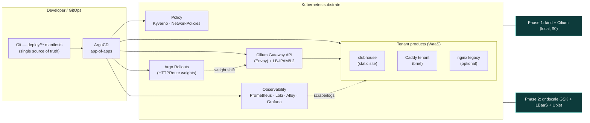
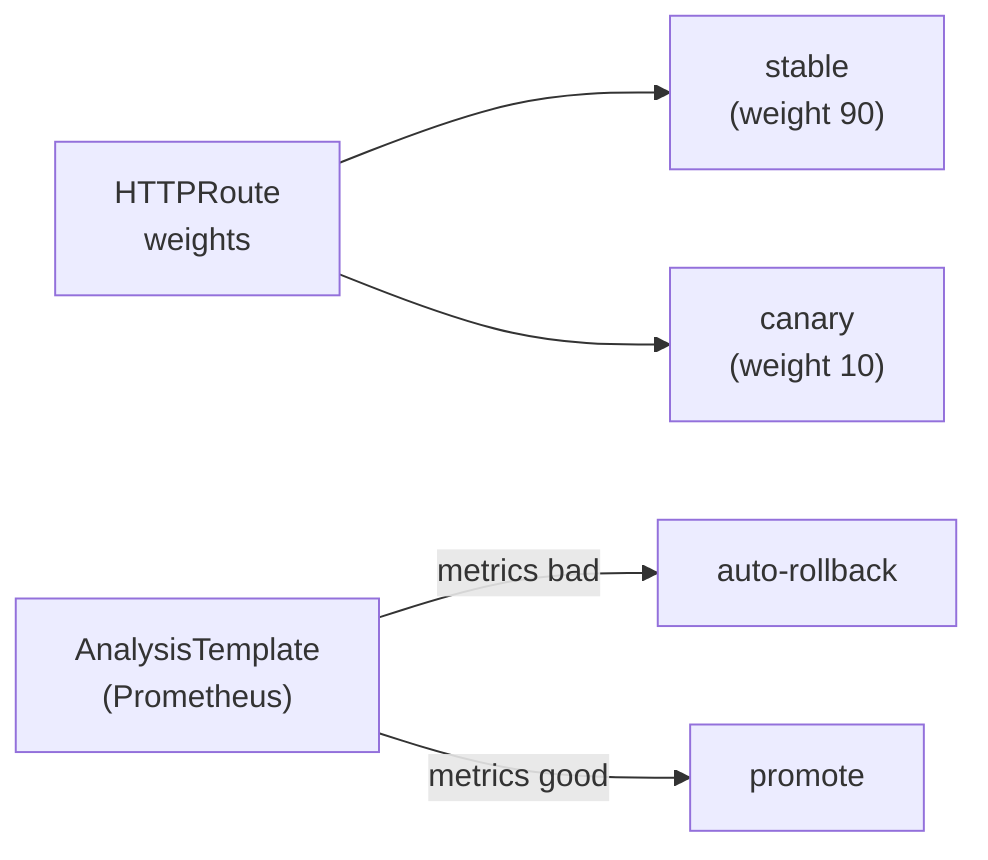
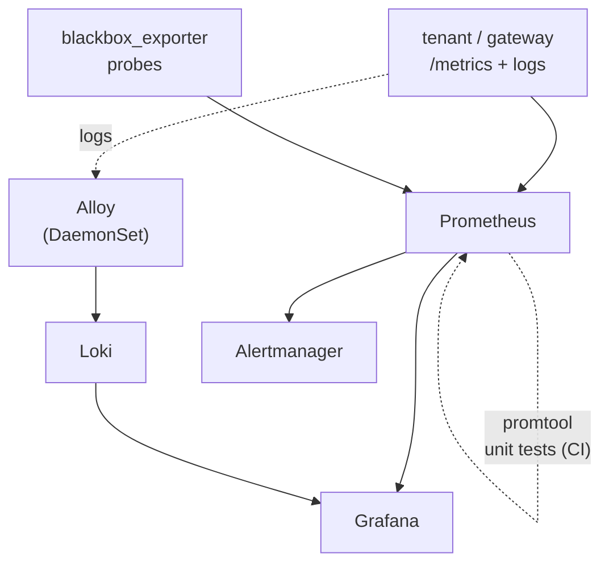

<!-- markdownlint-disable MD025 MD041 MD033 MD024 MD013 MD036 MD001 MD003 MD022 MD023 -->
---
theme: seriph
# Hybrid k8s-workshop visual port (ADR-0112 · E12c-S05): Inter + JetBrains Mono.
fonts:
  sans: 'Inter'
  mono: 'JetBrains Mono'
title: kaddy — Website-as-a-Service
info: |
  ## kaddy — a caddie for your websites
  Security-first, spec-driven, Kubernetes-native Website-as-a-Service.
  Built for the gridscale Platform Engineer exercise.
favicon: '/branding/favicon-32.png'
seoMeta:
  ogTitle: kaddy — a caddie for your websites
  ogDescription: >-
    Security-first, spec-driven, Kubernetes-native Website-as-a-Service.
    Built for the gridscale Platform Engineer exercise.
  ogImage: https://raw.githubusercontent.com/PlatformRelay/Kaddy/main/slides/public/branding/og-image.png
  twitterCard: summary_large_image
  twitterImage: https://raw.githubusercontent.com/PlatformRelay/Kaddy/main/slides/public/branding/og-image.png
layout: none
transition: slide-left
mdc: true
beat: pitch
sectionTime: 40
---

<!--
Section covers (E12b): every <CoverArt> `src` points at the FINAL artwork
filename under slides/public/covers/ (prompts + name map live in
slides/image-prompts.md). Cover filenames are STABLE ART IDS in generation
order (S00–S14) — after the E12-S04 narrative-arc restructure the displayed
§ numbers are renumbered to the new order, so a filename's NN may differ from
the kicker's §. Until a PNG is generated and dropped in, CoverArt falls back
to covers/placeholder-section.svg — no code change needed later. The
low-opacity "AI generated" footer it renders is a mandatory guardrail.

Narrative annotations (E12-S04): each section divider carries `sectionTime`
(seconds budgeted for the section, summing to a 5–10 min walkthrough) and the
seven spec beats carry `beat:` markers — pitch → architecture → security →
portal-hero → mulligan → marshal → scorecard (tests/deck/narrative-beats.sh).

Speaker notes (E12-S02): the LAST comment block on every slide is the
verbatim voiceover — read it word for word; the whole script is budgeted for
a 5–10 minute recording (tests/deck/speaker-notes-coverage.sh +
tests/deck/script-wordcount.sh).
-->

<CoverArt
  src="/covers/section-00-first-tee.png"
  kicker="§ 00 · The first tee"
  title="kaddy — a caddie for your websites"
/>

<!--
Hi, I'm Konrad. This is kaddy — my answer to the gridscale platform
engineering exercise.
-->

---
layout: cover
class: text-center
---


# kaddy

## A caddie for your websites

Security-first · spec-driven · Kubernetes-native **Website-as-a-Service**

<div class="pt-8 opacity-70 text-sm">
gridscale Platform Engineer exercise — platform engineering showcase
</div>

<div class="abs-br m-6 text-xs opacity-50">
github.com/PlatformRelay/Kaddy
</div>

<!--
The exercise says: install Caddy on a VM, serve a page, scrape it with
Prometheus, and fire an alert. I could have solved that with a bash script in
an afternoon. Instead, I built the platform that script would be one tenant
of — spec-driven, security-first, and Kubernetes-native. Over the next nine
minutes I'll show you what is actually running, what is deliberately still on
the drawing board, and why that distinction is the whole point of how I work.
-->

---
layout: none
sectionTime: 35
---

<CoverArt
  src="/covers/section-01-one-line-letter.png"
  kicker="§ 01 · The one-line letter"
  title="The brief, reframed"
/>

<!--
First, let's read the brief again — carefully. There's a bigger question
hiding in that one line.
-->

---
layout: statement
---

# The brief, reframed

*"Install Caddy on a Linux VM, serve a page, scrape it with Prometheus, fire an alert."*

<div class="pt-6 text-xl opacity-80">

A one-off VM script answers the letter of the exercise.

It does **not** answer the question a platform team is actually asking:

</div>

<div class="pt-4 text-2xl font-bold text-teal-400">
How do you run monitored, TLS-terminated websites as a repeatable, governed product?
</div>

<!--
Taken literally, the brief is one afternoon of work: a VM, a Caddyfile, a
scrape config, one alert rule. But that answers the letter of the exercise,
not the question behind it. A platform team isn't hiring someone to install
one web server. They're asking: how do you run monitored, TLS-terminated
websites as a repeatable, governed product? So that is the question I chose
to answer — with the original task kept fully intact inside it.
-->

---
layout: none
sectionTime: 45
---

<CoverArt
  src="/covers/section-02-one-hole-whole-course.png"
  kicker="§ 02 · One hole, whole course"
  title="From task to platform"
/>

<!--
So kaddy treats the exercise as one hole on a much bigger course.
-->

---
layout: two-cols
layoutClass: gap-8
---

# From task to platform

**The exercise as one tenant**

The named subject — install Caddy, serve, scrape, alert — is satisfied as a
single **Website-as-a-Service** tenant (`clubhouse`), reached *through* the
platform edge, not as a bespoke script.

- One self-service **claim** → a monitored, TLS-terminated site
- Observability, alerting, and progressive delivery are platform features every
  tenant inherits — not per-site glue
- The brief's optional nginx reverse-proxy is the same shape: a second tenant

::right::

<div class="pt-14">

## The caddie metaphor

| Component | Role |
| --- | --- |
| **clubhouse** | the sample website tenant (the brief) |
| **marshal** | alerting — PrometheusRules + Alertmanager |
| **mulligan** | blue/green + canary with auto-rollback |
| **scorecard** | k6 + metrics/logs → HTML evidence report |

<div class="pt-3">
<iframe src="https://clubhouse.kaddy.local:8443/" data-surface="clubhouse" data-surface-mode="live" class="w-full h-32 rounded border border-teal-800 bg-white"></iframe>
<div class="text-xs opacity-60 pt-1">
Live: clubhouse over TLS through the Cilium edge — <code>kubectl -n gateway port-forward svc/cilium-gateway-clubhouse 8443:443</code> + <code>clubhouse.kaddy.local → 127.0.0.1</code> in /etc/hosts (trust <code>kaddy-local-ca</code> once).
</div>
</div>

</div>

<!--
Concretely, the Caddy task becomes one tenant of a Website-as-a-Service
platform. The sample site is called clubhouse, and it's reached through the
platform edge like every other tenant. Observability, alerting, and
progressive delivery are platform features every tenant inherits — not glue
that gets rebuilt per site. And the naming isn't decoration: marshal is
alerting, mulligan is rollback, scorecard is evidence. Each name maps to a
directory and a capability, so incident conversations stay precise.
-->

---
layout: none
sectionTime: 45
---

<CoverArt
  src="/covers/section-03-honest-scorecard.png"
  kicker="§ 03 · The honest scorecard"
  title="What is actually landed vs designed"
/>

<!--
Before the architecture, the credibility slide: what's real today, and what
is still design.
-->

---
layout: statement
---

# What is actually landed vs designed

<div class="text-left max-w-3xl mx-auto pt-4 text-lg">

I am going to be precise about this, because a senior audience will check.

</div>

<div class="grid grid-cols-2 gap-6 pt-6 text-left max-w-4xl mx-auto">

<div class="p-4 rounded border border-green-600">

### ✅ Landed & gated on `main`

- **kind + Cilium** substrate (E1e) + **ArgoCD bootstrap** (E1)
- **GitOps app-of-apps** — 9/9 apps Synced/Healthy (E3)
- **Observability spine deployed** — Prometheus · Alertmanager · Grafana · Loki · Alloy
- **clubhouse over verified HTTPS** through the Cilium edge (E4)
- **marshal** rules + monitors + **promtool** unit tests (E5)
- **mulligan** blue/green + canary — **live HTTPRoute weight shift** (E7)
- **labels** + Rego + Kyverno · CI gates (gitleaks, conftest, `tofu test`, pins)

</div>

<div class="p-4 rounded border border-amber-600">

### 🧭 Designed — specs + manifests, not yet running

- Alertmanager **receiver** · dashboards-as-code · Loki log checks (E5 rest)
- Crossplane `Website` XRD (E6) · Dex OIDC (E1d)
- **Backstage portal auto-generated from the XRD** (E10)
- E1c enforcement **cutover** (policies authored + CLI-tested, runbook committed)
- Phase 2: gridscale **GSK + LBaaS + Upjet**

</div>

</div>

<div class="pt-6 text-center text-teal-400">
Phase 1 runs live on a $0 local cluster — and every "landed" claim has a gate behind it: ADRs, specs, manifests, enforced policy, tested alerts, gated CI.
</div>

<!--
I'll be precise here, because a senior audience will check. Running and gated
on main today: the kind-plus-Cilium substrate, ArgoCD with an app-of-apps —
nine of nine applications synced and healthy — the full observability spine
with Prometheus, Alertmanager, Grafana, Loki and Alloy, clubhouse served over
verified HTTPS through the Cilium edge, promtool-tested alert rules, and Argo
Rollouts shifting live traffic weights. Still designed, not running: the
Alertmanager receiver, the Crossplane Website XRD, Dex, and the Backstage
portal. Everything I claim, I can defend.
-->

---
layout: none
sectionTime: 55
---

<CoverArt
  src="/covers/section-15-neighbours-fences.png"
  kicker="§ 04a · Mending the neighbour's fences"
  title="Value already shipped for gridscale"
/>

<!--
Before the architecture, the part that matters most to you: I did not just
build a platform in a vacuum — I shipped real, external value for gridscale
along the way. Let me show you what is already landed on your side of the fence.
-->

---
layout: default
---

# Value already shipped for gridscale

<div class="text-sm opacity-70 -mt-2">§ 04a · landed external value — not a slide-ware promise</div>

<div class="grid grid-cols-2 gap-6 pt-4 text-left">

<div class="p-4 rounded border border-green-600">

### ✅ `provider-gridscale` — **landed**

A **Crossplane provider for gridscale**, generated with **Upjet** from the
`gridscale/gridscale` Terraform provider — **32 gridscale resources** as native
Kubernetes CRDs (servers, k8s, loadbalancers, firewalls, object storage, PaaS…).

Published to the **Upbound Marketplace**:
`marketplace.upbound.io/providers/platformrelay/provider-gridscale`

</div>

<div class="p-4 rounded border border-green-600">

### ✅ 3 bug-fix **MRs** upstream — **filed, open**

Three fixes filed against the **gridscale Terraform provider**
(`gridscale/terraform-provider-gridscale`), open and awaiting review:

- **[#509](https://github.com/gridscale/terraform-provider-gridscale/pull/509)** — 5 credential fields missing `Sensitive: true` (secrets rendered plaintext) — **security**
- **[#510](https://github.com/gridscale/terraform-provider-gridscale/pull/510)** — loadbalancer `status` should be `Computed`, not `Optional` (perpetual plan diff)
- **[#511](https://github.com/gridscale/terraform-provider-gridscale/pull/511)** — object-storage Update calls the wrong Read func; `marketplace_app.type` from the wrong source

</div>

</div>

<div class="pt-4 text-center text-teal-400">
I found these while building the provider — and fixed them at the source, for everyone. That is what a platform engineer does with your product.
</div>

<!--
This is the story I most want you to hear. While building the platform I
generated a Crossplane provider for gridscale with Upjet — thirty-two of your
resources exposed as native Kubernetes CRDs — and published it to the Upbound
Marketplace under the platformrelay org. Along the way I hit three real bugs in
your own Terraform provider and, rather than just working around them, I filed
fixes upstream: one security bug where five credential fields were missing the
sensitive flag and leaked into plaintext, one correctness bug where the
loadbalancer status caused a perpetual plan diff, and one copy-paste CRUD bug in
object storage. All three are open pull requests awaiting your review. I did not
wait to be asked — I made your product better on my way through. To be precise:
the provider is landed and on the Marketplace; the three upstream MRs are filed
and open, not yet merged.
-->

---
layout: none
sectionTime: 50
---

<CoverArt
  src="/covers/section-16-living-blueprint.png"
  kicker="§ 04b · The living blueprint"
  title="Crossplane — the IaC of platform engineering"
/>

<!--
So why Crossplane, and not just Terraform? Because a platform is a living thing,
and it needs infrastructure-as-code that keeps the world in sync — not a plan
you run once and walk away from.
-->

---
layout: default
---

# Crossplane — the IaC of platform engineering

<div class="grid grid-cols-2 gap-6 pt-2 text-left text-lg">

<div>

### One-shot Terraform

- You run `apply`; it converges **once**, then stops.
- Drift is silent until the next plan.
- The plan is a file, not an **API**.

### Crossplane control plane

- A **reconciling control loop** — the cluster continuously drives real
  infrastructure back to the declared state, like the rest of GitOps.
- **Composition**: many managed resources behind one opinionated abstraction.
- **XRD-as-API**: your platform's own API surface, projected into the portal.

</div>

<div>

The **`Website` XRD** is the whole point: a developer files one `Website` claim,
and Crossplane composes the gridscale server, loadbalancer, TLS edge and
monitoring behind it — the **same control-plane pattern** as everything else on
the cluster, and the same API the **Backstage portal** auto-generates its form
from (next section).

**Control plane, not one-shot.** That is why Crossplane is a first-class IaC
tool for platform engineering, and why `provider-gridscale` exists.

</div>

</div>

<!--
Here is why Crossplane, framed properly rather than hidden behind the portal
slide. One-shot Terraform converges once and then stops — drift stays silent
until the next plan, and the plan is a file, not an API. Crossplane is a
reconciling control plane: the cluster continuously drives real infrastructure
back to the declared state, exactly like the rest of GitOps. Two ideas carry it.
Composition lets me hide many managed resources behind one opinionated
abstraction. And the XRD — the composite resource definition — becomes my
platform's own API. A developer files a single Website claim; Crossplane composes
the gridscale server, the loadbalancer, the TLS edge and the monitoring behind
it. That same XRD is the API the Backstage portal generates its form from, which
is the hero moment two slides from now. Control plane, not one-shot — that is why
Crossplane is the infrastructure-as-code of platform engineering.
-->

---
layout: none
sectionTime: 55
---

<CoverArt
  src="/covers/section-17-spec-driven-greenskeeping.png"
  kicker="§ 04c · The spec-driven greenskeeping"
  title="How it was built — epic → plan → story → test"
/>

<!--
One more thing before the architecture, because it is the real differentiator:
how this platform was built. Every change earns its place through the same
OpenSpec loop — epic, plan, story, test — with guardrails wrapped around a
non-deterministic core. Let me walk one real epic end to end.
-->

---
layout: default
---

# How it was built — `epic → plan → story → test`

<div class="text-sm opacity-70 -mt-2">§ 04c · one real epic, walked end to end: <code>e5-monitoring-marshal</code></div>

<div class="grid grid-cols-4 gap-3 pt-4 text-left text-sm">

<div class="p-3 rounded border border-teal-700">

### 1 · Epic

`openspec/changes/`
**`e5-monitoring-marshal/`**

The change **folder** is the epic — the unit of work, versioned in git.

</div>

<div class="p-3 rounded border border-teal-700">

### 2 · Plan

`proposal.md`

Why + scope + non-goals + decisions. The **plan** the epic commits to.

</div>

<div class="p-3 rounded border border-teal-700">

### 3 · Story

`tasks.md` + `specs/monitoring/spec.md`

TDD slices + a **REQ** block: Given/When/Then, a **`Level:`**, and a **`Test:`** + **`Verify:`** per requirement.

</div>

<div class="p-3 rounded border border-teal-700">

### 4 · Test

`tests/promtool/marshal.test.yaml`

The concrete artifact the story named — a real **promtool `alert_rule_test`** that must go green.

</div>

</div>

<div class="pt-3 text-left max-w-4xl mx-auto text-sm opacity-90">

Example — **`REQ-E5-S01-01`** carries `Test: tests/promtool/caddy-mvp-marshal.test.yaml` and a
runnable `Verify:` (`promtool test rules …`). Every REQ in this repo does — a **gate matrix**
enforces it (`task test:spec`: 218 REQs, 218 `Verify` + `Test` blocks).

</div>

<div class="pt-2 text-center text-teal-400">
Guardrails wrap a non-deterministic core. Autonomy is earned by green gates — a coordinator dispatches worker subagents, each isolated, each TDD-first, each reviewed. And every run is a replayable audit.
</div>

<!--
Here is the real differentiator — how the platform was built. Every change runs
through the same OpenSpec loop: epic, plan, story, test. Take one real epic,
e5-monitoring-marshal. The change folder under openspec/changes is the epic —
the unit of work, versioned in git. Inside it, proposal dot md is the plan: why,
scope, non-goals, decisions. Tasks dot md plus the spec file are the story —
test-driven slices and a requirement block with Given, When, Then, a level tag,
and crucially a Test and a Verify line for every single requirement. REQ-E5-S01-01,
for instance, names tests/promtool/marshal as its test and gives you a runnable
promtool command to verify it. Then the concrete artifact exists and must go
green. This is not aspirational: a gate matrix enforces it — task test:spec
checks that all two hundred and eighteen requirements carry both a Verify and a
Test block, and it passes. The philosophy I borrowed and made my own: guardrails
wrap a non-deterministic core, autonomy is earned by green gates, a coordinator
dispatches isolated worker subagents that are TDD-first and reviewed, and every
run is a replayable audit. That is the how behind everything you have seen.
-->

---
layout: none
beat: architecture
sectionTime: 50
---

<CoverArt
  src="/covers/section-04-two-courses-one-blueprint.png"
  kicker="§ 04 · Two courses, one blueprint"
  title="Architecture — two phases, one set of manifests"
/>

<!--
Now the architecture — two phases, one blueprint.
-->

---
layout: default
---

# Architecture — two phases, one set of manifests



<div class="text-sm opacity-75 pt-2">

Same GitOps manifests target both substrates. Phase 1 (**kind + Cilium**, landed) is where the platform is developed; Phase 2 (**gridscale GSK**) re-syncs the identical apps behind LBaaS — deferred until Phase 1 is green. See `docs/ARCHITECTURE.md`, ADR-0102 (D-025), ADR-0104.

</div>

<!--
The design principle is portability. Everything is GitOps: the deploy
directory is the single source of truth, and ArgoCD converges the cluster
onto it. Phase one runs on a local kind cluster with Cilium — zero cloud
spend. Phase two is gridscale GSK with LBaaS in front. Critically, both
phases share the same manifests and the same edge shape — Cilium Gateway API
— so the promotion to gridscale is a re-sync, not a rewrite. And Caddy is a
tenant behind that edge, never the edge itself.
-->

---
layout: none
sectionTime: 35
---

<CoverArt
  src="/covers/section-05-practice-green.png"
  kicker="§ 05 · The practice green"
  title="Substrate — local kind + Cilium"
/>

<!--
A quick look at the substrate underneath — the practice green.
-->

---
layout: two-cols
layoutClass: gap-8
---

# Substrate — local kind + Cilium

**Phase 1 dev cluster (E1e — landed, gated)**

- `kind` cluster `kaddy-dev`, Kubernetes **v1.33.1**, single control-plane node
- **Cilium 1.18** — CNI, **kube-proxy replacement**, operator pinned
- **Gateway API** + **LB-IPAM / L2** — no MetalLB, no host-network hacks
- **cert-manager v1.18.2** + self-signed `kaddy-local-ca` issuer
- macOS-safe: Gateway/LB IPs asserted assigned; HTTP smoke via loopback port-maps
- Secure install: **pinned versions, no `:latest`, no secrets in git**

::right::

<div class="pt-14">

## Why this, not MetalLB

The edge on kind (**Cilium Gateway API + LB-IPAM/L2**) is the *same shape* as
gridscale Phase 2 (Cilium is GSK's default CNI; LBaaS fronts the same Gateway).

So the local cluster is a faithful rehearsal, not a toy — the promotion to
gridscale is a re-point, not a re-architecture.

<div class="pt-4 text-sm opacity-70">

The 3-node Talos **driving-range** was deferred to an optional maturity-contrast
spike (D-025) after libvirt/Talos yak-shaving stalled Phase 1 — a pragmatic call,
documented, not hidden.

</div>

</div>

<!--
The local cluster is kind running Kubernetes 1.33 with Cilium 1.18 as the
CNI — kube-proxy replacement, Gateway API, and LB-IPAM. No MetalLB, no
host-network hacks, versions pinned, no secrets in git. And I'll own the
detour: I started on a three-node Talos cluster, burned hours on libvirt
yak-shaving, and made the documented call to park it and keep momentum on
kind. That trade-off is written down in the decision log, not hidden.
-->

---
layout: none
sectionTime: 45
---

<CoverArt
  src="/covers/section-06-greenkeepers-scroll.png"
  kicker="§ 06 · The greenkeepers' scroll"
  title="GitOps — ArgoCD app-of-apps"
/>

<!--
Here's GitOps doing its job — the greenkeepers and their scroll.
-->

---
layout: default
---

# GitOps — ArgoCD app-of-apps

<div class="grid grid-cols-2 gap-6">

<div>

**Landed (E1 + E3) — running live on the local cluster**

- A single **root** `Application` watches `deploy/apps/` and discovers child apps:
  `gateway`, `observability`, `identity`, `platform-core`, `workloads` —
  **9/9 Synced/Healthy**
- Committed steady-state truth is `targetRevision: main` — merging a lane is what
  makes ArgoCD sync it for real
- **Self-heal + prune** on the root: delete a child manifest → the child
  de-registers (true GitOps convergence)

</div>

<div>

```yaml
# deploy/apps/root.yaml (excerpt)
spec:
  source:
    repoURL: github.com/PlatformRelay/Kaddy
    targetRevision: main
    path: deploy/apps
    directory:
      recurse: false
      exclude: root.yaml
  syncPolicy:
    automated:
      prune: true
      selfHeal: true
```

<iframe src="https://127.0.0.1:30443/applications" data-surface="argocd" data-surface-mode="live" class="w-full h-36 rounded border border-teal-800 bg-white"></iframe>
<div class="text-xs opacity-60 pt-1">
Live: the ArgoCD UI — kind maps the NodePort to <code>https://127.0.0.1:30443</code> (accept the local CA in the browser once before recording).
</div>

</div>

</div>

<div class="text-sm opacity-75 pt-3">

Every `Application` carries the mandatory ADR-0301 label set (`owner`, `service`, `part-of`, `managed-by`, `track`, `data-classification`, `business-criticality`) — governance reaches the control plane, not just workloads.

</div>

<!--
This is live. A single root application watches deploy-slash-apps and
discovers the children: gateway, observability, identity, platform core,
workloads — nine of nine synced and healthy. Self-heal and prune are on, so
drift gets raked back and deleted manifests de-register. One discipline I
hold: the committed target revision is always main. A feature branch proves
itself on a runtime override, but committed truth is never an unmerged
branch. That keeps main permanently deployable — and what you see here is the
actual ArgoCD UI.
-->

---
layout: none
beat: security
sectionTime: 45
---

<CoverArt
  src="/covers/section-08-gatehouse-inspection.png"
  kicker="§ 07 · The gatehouse inspection"
  title="Security & governance"
/>

<!--
Security next — the gatehouse, where every bag gets inspected.
-->

---
layout: default
---

# Security & governance — the maturity flex

<div class="grid grid-cols-3 gap-4 text-sm">

<div class="p-3 rounded border border-teal-700">

### Secrets

**SOPS + age** (ADR-0110)

- Encrypted YAML in git — IaC that survives rebuild-from-scratch
- `encrypted_regex` on `data`/`stringData` → structural diffs stay reviewable
- age private key on operator host only
- Applied via **KSOPS** in ArgoCD

</div>

<div class="p-3 rounded border border-teal-700">

### Policy as code

**Labels enforced two ways** (ADR-0301)

- **OPA / Rego** (`policy/labels.rego`) gates OpenTofu plans in CI (conftest)
- **Kyverno** `ClusterPolicy` enforces the same 7 bare keys on Pods at admission
- Default-deny **NetworkPolicies** authored + admission baseline CLI-tested (E1c, cutover runbook committed)

</div>

<div class="p-3 rounded border border-teal-700">

### Supply chain & CI

**Gated `verify.yaml`**

- **gitleaks 8.30.1** secret scan — in CI, not just bypassable pre-commit
- conftest · `tofu test` · E1e meta gates
- **All installs pinned** (gitleaks, conftest, ripgrep) — Renovate-trackable, no `apt` floats
- Data-flow **security review committed** (`docs/security/`) · replayable audits (E11) specced

</div>

</div>

<div class="pt-5 text-center">

Regulatory grounding (public texts only): **NIS2** Art. 21(2)(i) asset mgmt · **BSI KRITIS** inventory & classification · **GDPR** Art. 30/32 → operationalised as the mandatory label set.

</div>

<!--
Three layers here. Secrets: SOPS with age — encrypted YAML committed to git
and applied through KSOPS, so the cluster can be rebuilt from scratch without
a secrets scramble. Policy as code: the same seven-label governance set is
enforced twice — Rego gates OpenTofu plans in CI, and Kyverno enforces it
again at admission. That's defense in depth on governance itself. Supply
chain: gitleaks runs in CI, every install is pinned, no floating tags. And
the trajectory is auditable — a data-flow security review is committed, and
replayable audit runs are specced as E-eleven.
-->

---
layout: none
beat: portal-hero
sectionTime: 40
---

<CoverArt
  src="/covers/section-14-caddies-order-desk.png"
  kicker="§ 08 · The caddie's order desk"
  title="Self-service portal — auto-generated from the XRD"
/>

<!--
Now the money shot — self-service, where the form writes itself.
-->

---
layout: two-cols
layoutClass: gap-8
---

# Portal — auto-generated from the XRD

**The money shot (E10, designed):** nobody hand-writes the portal form.

- **kubernetes-ingestor** reads the Crossplane `Website` XRD and
  **auto-generates** the Backstage scaffolder form
- Edit the XRD → **the form updates itself** — the platform API stays the
  single source of truth (ADR-0111)
- Submitting opens a **GitOps PR** with a `Website` XR → ArgoCD applies →
  Crossplane reconciles
- Read-path plugins render live status in-portal: **Crossplane resource
  graph**, ArgoCD apps, K8s workloads (D-029)

::right::

<div class="pt-6 text-sm">

<div data-surface="backstage" data-surface-mode="fallback" class="p-3 rounded border border-amber-700">
<strong>Backstage scaffolder — fallback</strong><br/>
Not running yet (E10 designed). Record-time stand-in per <code>slides/recording-guide.md</code> (shot 1): drop the GIF at
<code>slides/public/surfaces/backstage-xrd-edit.gif</code> and flip this slot to an <code>&lt;img&gt;</code> — shown instead of a live iframe, per the spec's fallback clause.
</div>

<div data-surface="crossplane-graph" data-surface-mode="fallback" class="p-3 rounded border border-amber-700 mt-3">
<strong>Crossplane resource graph — fallback</strong><br/>
Not running yet (E6/E10 designed). Record-time stand-in per <code>slides/recording-guide.md</code> (shot 6):
<code>slides/public/surfaces/crossplane-graph-provision.gif</code> — flip this slot to an <code>&lt;img&gt;</code> once recorded; replaced by the live in-portal graph when E10 lands.
</div>

<div class="pt-3 opacity-80">

**Honesty:** E10 is specced (ADR-0109 / ADR-0111, D-027…D-029) and gated behind
the spine — shown here as design, not a running portal. Orchestrator-first:
Crossplane (E6) *is* the platform API; Backstage is the experience layer on top.

</div>

</div>

<!--
This is the platform's north star, and I want to be upfront: it is designed,
not deployed yet. The idea: nobody hand-writes the portal form.
Kubernetes-ingestor reads the Crossplane Website XRD and auto-generates the
Backstage scaffolder form from it. Change the API, and the form updates
itself. Submitting doesn't touch the cluster directly — it opens a GitOps
pull request, ArgoCD applies it, Crossplane reconciles it. The platform API
stays the single source of truth, end to end.
-->

---
layout: none
beat: mulligan
sectionTime: 50
---

<CoverArt
  src="/covers/section-09-mulligans-second-chance.png"
  kicker="§ 09 · Mulligan's second chance"
  title="Caddy-MVP tenant & mulligan"
/>

<!--
Which brings us to mulligan — the retriever that fetches bad releases back.
-->

---
layout: two-cols
layoutClass: gap-8
---

# Caddy-MVP tenant (WaaS)

**Caddy is the platform MVP — a tenant product, never the edge** (ADR-0104, D-019).

The platform edge is Cilium Gateway API (Envoy). Caddy is reached *through* it.

Two Backstage-scaffoldable variants (both also exist for nginx):

- **Variant A — VM (minimal):** Caddy on a VM + alerting. In-cluster Prometheus
  scrapes the VM's `/metrics`. This is the brief spine **serve → scrape → fire**,
  and where the `caddy_*` marshal alerts live (`deploy/caddy-mvp/monitoring/`).
- **Variant B — Kubernetes (rich, preferred):** cert-manager certs, in-cluster
  scrape, **blue/green + canary via Argo Rollouts**.

::right::

<div class="pt-10">

## Progressive delivery — mulligan



<div class="text-sm opacity-75 pt-3">

**Landed (E7):** Argo Rollouts mutates **Gateway API HTTPRoute weights** —
proven live on the cluster: `100/0 → 20 → 50 → 100`. Blue/green promotion and
abort→rollback proven; `hack/demo/mulligan.sh` choreographs the two-act demo.

</div>

</div>

<!--
Two things on this slide. First, the Caddy tenant itself comes in two
scaffoldable variants: a minimal VM flavour — which is literally the brief:
serve, scrape, fire — and a richer Kubernetes flavour with certificates and
progressive delivery. Second: mulligan is landed. Argo Rollouts mutates
Gateway API HTTPRoute weights, and I've proven it live — traffic stepping
from one hundred percent to eighty-twenty, fifty-fifty, then full cutover,
with abort and rollback demonstrated. A Prometheus analysis template gates
promotion, so a bad canary walks itself back automatically.
-->

---
layout: none
beat: marshal
sectionTime: 45
---

<CoverArt
  src="/covers/section-07-marshals-tower.png"
  kicker="§ 10 · The marshal's tower"
  title="Observability spine — marshal"
/>

<!--
Watching over all of it: marshal, up in the tower.
-->

---
layout: default
---

# Observability spine — marshal

<div class="grid grid-cols-2 gap-6">

<div>

**Landed (E5 rules + E3 spine, running via GitOps):**

- **PrometheusRules** — instance down, error rate, latency, request rate
- ServiceMonitor / PodMonitor + **blackbox_exporter** probes (uptime, status codes)
- **promtool unit tests for every alert rule** — an alert's *correctness* is proven
  in CI (L1), not assumed
- **kube-prometheus-stack + Loki + Grafana Alloy deployed** — logs + metrics in
  one Grafana pane (ADR-0108)

**Open (E5 completion):**

- **Alertmanager receiver** (ntfy/webhook) — the "fire" leg
- Dashboards-as-code + Loki 5xx log checks

</div>

<div>



<div class="text-center text-sm text-teal-400 pt-2">
An alert can fire end-to-end — and its rule is unit-tested.
</div>

<iframe src="http://127.0.0.1:3000/alerting/list" data-surface="grafana" data-surface-mode="live" class="w-full h-32 rounded border border-teal-800 bg-white"></iframe>
<div class="text-xs opacity-60 pt-1">
Live: Grafana (marshal pane) — <code>kubectl -n monitoring port-forward svc/kube-prometheus-stack-grafana 3000:80</code> → <code>http://127.0.0.1:3000</code>.
</div>

</div>

</div>

<!--
The observability spine is running via GitOps: kube-prometheus-stack, Loki
and Alloy — metrics and logs in one Grafana pane. Marshal's alert rules cover
instance down, error rate, latency and request rate, plus blackbox probes for
uptime. The differentiator: every alert rule has a promtool unit test in CI.
"Alert on server down" isn't a claim, it's a regression test. What's honestly
still open is the receiver leg — Alertmanager routing to a webhook — plus
dashboards-as-code. That is the current E-five work.
-->

---
layout: none
beat: scorecard
sectionTime: 40
---

<CoverArt
  src="/covers/section-10-five-hole-walkthrough.png"
  kicker="§ 11 · The five-hole walkthrough"
  title="Demo flow"
/>

<!--
Let's walk the demo — five holes, and the scorecard writes itself.
-->

---
layout: default
---

# Demo flow

<div class="text-lg">

A crisp, five-beat live path — each beat maps to a landed or designed capability:

</div>

<div class="pt-4 grid grid-cols-1 gap-2 text-base max-w-4xl">

1. **GitOps** — open ArgoCD; show the app-of-apps tree syncing from `deploy/apps/`
2. **Serve** — `curl https://clubhouse…/` returns the site over TLS at the Cilium Gateway
3. **Observe** — Grafana: request rate / latency / status codes + Loki access logs, one pane
4. **Alert** — drive load with **k6** past threshold → **marshal** fires → Alertmanager routes *(the rule is already promtool-tested in CI)*
5. **Deliver** — **mulligan** canary with a bad build → AnalysisTemplate fails → **auto-rollback** → alert clears

</div>

<div class="pt-5 text-teal-400">

The whole run is captured by **scorecard** (k6 + metrics/logs) into a self-contained **HTML evidence report** — reproducible proof, not screenshots.

</div>

<div class="text-sm opacity-60 pt-3">
Beats 1–3 and 5 run live on the local cluster today (`hack/demo/mulligan.sh` drives the delivery act); beat 4's receiver leg is the remaining E5 work; scorecard capture is E8.
</div>

<!--
The demo is five beats. One: the ArgoCD tree, live. Two: curl clubhouse over
TLS through the Cilium gateway, live. Three: Grafana — one pane for metrics
and logs, live. Four: drive load with k6 until marshal fires; the rule itself
is already regression-tested, the receiver is the open leg. Five: a bad
canary auto-rolls back, live. And the point of scorecard is that this whole
run becomes a reproducible HTML evidence report — proof you can re-run, not
screenshots.
-->

---
layout: none
sectionTime: 30
---

<CoverArt
  src="/covers/section-11-back-nine-at-dawn.png"
  kicker="§ 12 · The back nine at dawn"
  title="Roadmap & honest status"
/>

<!--
What's left on the course? The back nine, at dawn.
-->

---
layout: default
---

# Roadmap & honest status

<div class="grid grid-cols-2 gap-8 text-sm">

<div>

**Phase 1 — local kind ($0 cloud)**

| Epic | Scope | Status |
| --- | --- | --- |
| E1e | kind + Cilium substrate | ✅ landed |
| E1 · E3 | ArgoCD bootstrap + GitOps core | ✅ landed |
| E4 | clubhouse + verified TLS | ✅ landed |
| E1b | labels module + policy | ✅ landed |
| E7 | mulligan rollouts (live weight shift) | ✅ landed |
| E5 | marshal — receiver/dashboards leg | 🚧 rules ✅ |
| E6 | Crossplane `Website` XRD | 🧭 designed |
| E10 | Backstage portal (auto-gen) | 🧭 designed |

</div>

<div>

**Phase 2 — gridscale lab (deferred)**

| Epic | Scope | Status |
| --- | --- | --- |
| E1g | GSK day-0 (Terramate) | 🧭 deferred |
| E6g | Upjet provider-gridscale VM | 🧭 deferred |
| E8b | live demo environment | 🧭 deferred |

**Gate to Phase 2:** E3–E7 green on local kind.

</div>

</div>

<div class="pt-4 text-center opacity-80">

Every epic is an **OpenSpec change** with `Verify:` + `Test:` per requirement, driven TDD-first. The backlog is the spec.

</div>

<!--
The status table is deliberately honest. Substrate, GitOps core, clubhouse
with verified TLS, labels and policy, and mulligan are landed. Marshal's
receiver leg is in flight. Crossplane and the portal are designed. Phase two
— gridscale GSK, LBaaS, the Upjet provider — stays deferred until the local
platform is fully green, which keeps cloud spend at zero. Every epic is an
OpenSpec change with tests per requirement; the backlog is the spec.
-->

---
layout: none
sectionTime: 30
---

<CoverArt
  src="/covers/section-12-signed-scorecard.png"
  kicker="§ 13 · The signed scorecard"
  title="Why this answers the exercise"
/>

<!--
So — does this answer the exercise? Here's the signed card.
-->

---
layout: statement
---

# Why this answers the exercise

<div class="text-left max-w-3xl mx-auto pt-4 text-lg space-y-3">

- **Serve · scrape · alert** — satisfied live through the Cilium edge, as a *repeatable tenant product*, with the alert rules **unit-tested in CI**
- **IaC & automation** — GitOps app-of-apps (9/9 Synced/Healthy), SOPS-encrypted secrets in git, pinned & gated supply chain
- **Documentation** — README reviewer paths, ADRs, OpenSpec specs, this deck
- **Evidence** — scorecard turns the demo into a reproducible HTML report, not screenshots
- **Beyond the brief** — landed progressive delivery with live traffic shifting, governance (NIS2-style labels, Rego + Kyverno), centralized logs, OIDC designed

</div>

<div class="pt-6 text-2xl font-bold text-teal-400">
A platform team can adopt this. That was the point.
</div>

<!--
Serve, scrape, alert: satisfied, live, through a real platform edge, with the
alert rules unit-tested in CI. Infrastructure as code and automation: GitOps
end to end, with encrypted secrets in git. Documentation: ADRs, OpenSpec
specs, reviewer paths. Evidence: reproducible reports rather than
screenshots. And beyond the brief: live progressive delivery, enforced
governance, centralized logs. The claim I will stand behind: a platform team
could adopt this repo tomorrow. That was the point.
-->

---
layout: none
sectionTime: 15
---

<CoverArt
  src="/covers/section-13-nineteenth-hole.png"
  kicker="§ 14 · The nineteenth hole"
  title="Thank you"
/>

<!--
That's the round. Thank you — let's head to the nineteenth hole.
-->

---
layout: center
class: text-center
---

# Thank you

**kaddy** — a caddie for your websites

<div class="pt-4 opacity-80">

Repo · `github.com/PlatformRelay/Kaddy`
5-min path · `docs/requirements/exercise-traceability.md`
Deep dive · `docs/adr/README.md` → `docs/ARCHITECTURE.md` → `openspec/changes/`

</div>

<div class="pt-8 text-teal-400 text-lg">
Questions?
</div>

<!--
If you want to verify any claim from this walkthrough, the repo is structured
for it: the traceability matrix gives you the five-minute path from each
brief requirement to its epic, and the ADR index takes you into the deep
dive. Everything in this deck is checkable. Thanks for watching — I'm happy
to take questions.
-->

---
layout: none
---

<!-- APPENDIX -->
<!--
This is the gate-exempt appendix boundary (E12c-S01). Everything past this
sentinel is depth material for Q&A — it does not count toward the main deck's
~15-minute time or word budget. The main talk ended at "Thank you"; from here
on, dip in only if a question sends us here.
-->

<CoverArt
  src="/covers/placeholder-section.svg"
  kicker="§ A · Appendix"
  title="Appendix — depth for questions"
/>

<!--
Appendix. If a question wants the NixOS path, the repo layout, a five-minute
quickstart, or the three ways I solved the same brief, the slides are here —
outside the recorded fifteen minutes, ready when you are.
-->

---
layout: default
---

# §A-1 · The NixOS path — *designed*

<div class="inline-block px-2 py-0.5 rounded bg-amber-700/40 border border-amber-600 text-sm">🧭 Designed — not landed</div>

<div class="pt-4 text-left max-w-3xl mx-auto text-lg">

Today's golden-image path is **Packer** — `packer/caddy.pkr.hcl` and
`packer/nginx.pkr.hcl` build the gridscale Marketplace VM images (E13). That is
what actually ships.

The **NixOS path** is the designed Phase-3 evolution: reproducible, bit-for-bit
golden images built from a Nix flake, recorded as **E14 / ADR-0303** (Status:
*Proposed*, alongside Packer — it does not supersede it).

**Honest caveat:** there is **no `flake.nix` in this repo yet.** This slide is a
*designed* beat, held to the same landed-vs-designed scorecard as everything
else — I am not going to pretend it is running.

</div>

<!--
The NixOS path, and I am tagging it designed, not landed. What ships today is
Packer — packer slash caddy dot pkr dot hcl and its nginx sibling build the
gridscale Marketplace images in E13. The designed Phase-3 evolution is Nix:
reproducible, bit-for-bit golden images from a flake, recorded as E14 and
ADR-0303, proposed, alongside Packer rather than replacing it. The honest
caveat, because a senior audience will check: there is no flake dot nix in this
repo yet. This is a drawing-board beat, held to the same scorecard as everything
else — I will not pretend it runs.
-->

---
layout: default
---

# §A-2 · Repo tour — the estate map

<div class="grid grid-cols-2 gap-x-8 gap-y-1 pt-4 text-left text-sm font-mono">

<div>

- `deploy/` — GitOps manifests (ArgoCD app-of-apps)
- `stacks/` — OpenTofu/Terramate day-0 IaC
- `modules/` — reusable Tofu modules (labels)
- `compositions` → in `deploy/` — Crossplane XRD/Compositions
- `packer/` — Marketplace VM image builds
- `policy/` — Rego + Kyverno governance

</div>

<div>

- `openspec/` — epics → plans → stories (REQs)
- `tests/` — the gate matrix (promtool, smoke, deck…)
- `hack/` — scripts (cluster, scorecard, verify)
- `docs/` — ADRs, ROADMAP, architecture
- `evidence/` — reproducible scorecard reports
- `slides/` — this Slidev deck
- `operator/` — the Kubebuilder operator

</div>

</div>

<div class="pt-3 text-center text-teal-400 text-sm">
Every top-level directory has one job. The whole estate at a glance — a tree you can navigate.
</div>

<!--
The repo tour — the estate map, so you can find anything. Deploy holds the
GitOps manifests, the ArgoCD app-of-apps. Stacks is the OpenTofu and Terramate
day-zero infrastructure; modules are the reusable Tofu modules. Packer builds
the Marketplace VM images; policy is the Rego and Kyverno governance. Openspec
is the epics, plans and stories — the REQs. Tests is the whole gate matrix.
Hack is the scripts, docs is the ADRs and roadmap, evidence is the reproducible
scorecard reports, slides is this deck, and operator is the Kubebuilder
operator. Every top-level directory has exactly one job — a tree you can
navigate.
-->

---
layout: default
---

# §A-3 · Quickstart & tools — Kaddy's kit bag

<div class="pt-2 text-left max-w-3xl mx-auto">

```bash
task cluster:up        # kind + Cilium + Gateway API + cert-manager
task bootstrap:argocd  # pinned ArgoCD + app-of-apps
task test:smoke:e5     # marshal monitoring smoke (needs a green cluster)
task demo              # the choreographed mulligan weight-shift demo
```

</div>

<div class="pt-3 text-left max-w-3xl mx-auto text-sm">

**Tools of the trade:** Task · kind · kubectl · helm · **OpenTofu** · Terramate ·
Packer · conftest · promtool · **k6** · gitleaks · **SOPS** · cosign.

Missing a tool? Every gate **skips-not-fails** when its CLI is absent — the repo
stays honest on a bare machine.

</div>

<!--
Quickstart, and the tools — Kaddy's kit bag. Task cluster colon up brings up
kind with Cilium, the Gateway API and cert-manager; task bootstrap colon argocd
installs pinned ArgoCD and the app-of-apps; task test colon smoke colon e5 runs
the marshal monitoring smoke against a green cluster; and task demo runs the
choreographed mulligan weight-shift. The tools of the trade are Task, kind,
kubectl, helm, OpenTofu, Terramate, Packer, conftest, promtool, k6, gitleaks,
SOPS and cosign. And if you are missing one, every gate skips rather than fails
when its CLI is absent, so the repo stays honest even on a bare machine.
-->

---
layout: default
---

# §A-4 · Solved different ways — three routes to the same green

<div class="grid grid-cols-3 gap-4 pt-4 text-left text-sm">

<div class="p-3 rounded border border-green-600">

### 🚗 Caddy VM — *the brief*

The literal exercise: **Caddy on a Linux VM**, a page served, Prometheus
scraping, an alert firing. Delivered as the Packer image + the `clubhouse`
tenant. **Landed.**

</div>

<div class="p-3 rounded border border-green-600">

### ☸ Rich K8s variant

The same tenant as a first-class **Kubernetes** citizen: Crossplane `Website`
claim → TLS edge → monitored → progressive delivery. The platform's main path.
**Landed.**

</div>

<div class="p-3 rounded border border-amber-600">

### ❄ Nix golden image

The **designed** Phase-3 route (E14/ADR-0303): one reproducible Nix-built image,
several identical greens. **Designed — not yet grown.**

</div>

</div>

<div class="pt-3 text-center text-teal-400">
Same destination, deliberate choices — I walked all three ways on purpose, and I am precise about which are landed and which are designed.
</div>

<!--
Solved different ways — three routes to the same green, because the same brief
can be delivered more than one way and I chose deliberately. Route one is the
literal exercise: Caddy on a Linux VM, a page served, Prometheus scraping, an
alert firing — delivered as the Packer image and the clubhouse tenant, and it is
landed. Route two is the rich Kubernetes variant: the same tenant as a
first-class citizen, a Crossplane Website claim composing the TLS edge,
monitoring and progressive delivery — the platform's main path, also landed.
Route three is the Nix golden image, the designed Phase-3 route from E14 and
ADR-0303 — one reproducible image, many identical greens — and that one is
designed, not yet grown. Same destination, deliberate choices, and I am precise
about which are landed and which are designed.
-->
