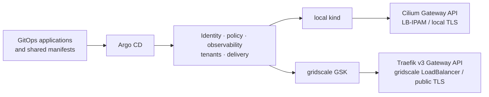

<!-- markdownlint-disable MD025 MD041 MD033 MD024 MD013 MD036 MD001 MD003 MD022 MD023 -->

<CoverArt
  src="/covers/section-00-first-tee.png"
  kicker="The first tee"
  title="kaddy — a caddie for your websites"
/>

<!--
Hi, I am Konrad. I built kaddy as a practical answer to a platform engineering exercise: a Website-as-a-Service product with repeatable delivery, controls, operations, and evidence. I will separate what is built and proven from what is still open.
-->

---
layout: default
---

The brief

# One website, treated as a product

  

    <KdIcon name="material-symbols:description-outline-rounded" size="1.5em" />
    <h3>The requested outcome</h3>
    
Install Caddy on Linux, serve a page, scrape it with Prometheus, and fire an alert.

  

  

    <KdIcon name="material-symbols:account-tree-outline-rounded" size="1.5em" />
    <h3>The platform question</h3>
    
How can a team deliver monitored, TLS-terminated websites repeatedly, with policy and evidence built in?

  

  I kept the literal VM path, then built the reusable platform around it.

<!--
The brief asks for a Caddy server, a page, monitoring, and an alert. I kept that outcome visible throughout the repository. I also treated it as a product question: how would a platform team make the same capability repeatable for the next website, with sensible defaults and proof that it works?
-->

---
layout: default
---

Product shape

# From one task to four deliberate paths

  
Website intent

  
→

  
Packer Marketplace VM

  
In-cluster tenant

  
Crossplane Website

  
Nix-built image

  
<strong>marshal</strong>metrics, logs, alerts

  
<strong>mulligan</strong>progressive delivery and rollback

  
<strong>scorecard</strong>replayable HTML evidence

  <KdIcon name="material-symbols:check-circle-rounded" /> shared platform capabilities

<!--
The same intent now has several delivery paths. Packer produces the gridscale Marketplace VM. Kubernetes runs the richer in-cluster tenant. Crossplane exposes a Website API and demo claim. Nix builds a reproducible image, although boot-to-serve is not yet proven. Marshal, mulligan, and scorecard provide shared operations around those paths.
-->

---
layout: default
---

Current status

# Built and proven — with a short open list

  

    <h3><KdIcon name="material-symbols:verified-rounded" /> Landed at documented scope</h3>
    <ul>
      <li>Website XRD, Composition, and demo claim</li>
      <li>Dex GitHub OIDC; dashboards-as-code</li>
      <li>Kyverno Enforce and default-deny baseline</li>
      <li>scorecard HTML generation and Pages workflow</li>
      <li>two dated audits; public GSK HTTPS proofs</li>
      <li>Packer serving proof; Nix image build</li>
    </ul>
  

  

    <h3><KdIcon name="material-symbols:pending-actions-rounded" /> Still open</h3>
    <ul>
      <li>Backstage runtime</li>
      <li>external Alertmanager receiver</li>
      <li>Loki ruler alert</li>
      <li>Nix boot-to-serve</li>
      <li>three upstream pull-request merges</li>
    </ul>
  

<!--
This is the status line I use for the rest of the walkthrough. The Website API, including its ephemeral gridscale VM proof, identity, dashboards, enforced policy, scorecard publishing, audits, cloud edge, Packer path, and Nix build are present at their documented scope. The open work is narrower: portal runtime, external alert delivery, Loki ruler, Nix boot, and upstream merges.
That separation matters because several artifacts are complete at one layer but not at the next. A committed configuration is not automatically a running service, an image build is not a successful boot, and an open pull request is not an upstream merge. I use those boundaries consistently.
-->

---
layout: default
---

External contribution

# Work that also improved the gridscale ecosystem

  

    <KdIcon name="mdi:package-variant-closed" size="1.7em" />
    <h3><code>provider-gridscale</code></h3>
    
An Upjet-generated Crossplane provider exposing <strong>32 gridscale resources</strong> as Kubernetes APIs.

    
<a href="https://marketplace.upbound.io/providers/platformrelay/provider-gridscale">marketplace.upbound.io/providers/platformrelay/provider-gridscale</a>

  

  

    <KdIcon name="mdi:source-pull" size="1.7em" />
    <h3>3 upstream pull requests</h3>
    
Security and correctness fixes found while generating the provider. They are filed and open, not merged.

    
<a href="https://github.com/gridscale/terraform-provider-gridscale/pull/509">#509</a> · <a href="https://github.com/gridscale/terraform-provider-gridscale/pull/510">#510</a> · <a href="https://github.com/gridscale/terraform-provider-gridscale/pull/511">#511</a>

  

<KdIcon name="material-symbols:deployed-code-rounded" /> shipped <KdIcon name="material-symbols:merge-type-rounded" /> upstream review open

<!--
Building the gridscale integration produced useful work outside this repository. Provider-gridscale publishes thirty-two gridscale resources through Crossplane’s API model. During generation I found three issues in the Terraform provider and submitted fixes upstream. The provider is shipped; the pull requests are still open, so I do not count them as merged value.
-->

---
layout: default
---

How I worked

# A spec-to-test loop I can replay

  
1<strong>Epic</strong><code>e5-monitoring-marshal</code>

  
2<strong>Plan</strong><code>proposal.md</code>

  
3<strong>Story</strong><code>tasks.md</code> + <code>REQ-…</code>

  
4<strong>Test</strong><code>promtool</code> + gate matrix

  OpenSpec records intent; the named test demonstrates behavior; the gate keeps both connected.

  The authoritative coverage script derives the current requirement total; this deck avoids freezing that count.

<!--
I used the same loop for each meaningful change. The OpenSpec change folder names the epic. Proposal dot md explains scope and trade-offs. Tasks dot md and the requirement blocks define testable slices. The requirement names a concrete test and verify command, and the gate matrix checks that connection. I avoid putting a fast-changing requirement count on a slide.
This gives a reviewer three useful entry points: the decision and scope, the expected behavior, and the executable proof. It also made course corrections safer, because a changed cloud assumption could be reflected in the spec and tests instead of being hidden in an ad hoc script.
-->

---
layout: none
title: Shared platform applications, different edges
beat: architecture
sectionTime: 170
---

<CoverArt
  src="/covers/section-04-two-courses-one-blueprint.png"
  kicker="Architecture"
  title="Shared platform applications, different edges"
/>

<!--
The architecture reuses the platform applications and manifests, while allowing each substrate to use the edge it can actually support.
-->

---
layout: default
---

Architecture

# One GitOps platform, two edge implementations

  
<strong>Shared</strong>platform applications, workload intent, policy, observability, and GitOps operating model

  
<strong>Different by design</strong>edge controller, certificates, hostnames, and substrate-specific overlays

<!--
The reusable part is the platform: Argo CD applications, workload intent, identity, controls, observability, and delivery. The edges differ. Local kind uses Cilium Gateway API. GSK uses Traefik version three behind the gridscale LoadBalancer because the managed Cilium installation cannot serve Gateway API. Promotion therefore includes an intentional edge overlay, not a simple repoint.
That distinction keeps portability honest. I can reuse a large part of the operating model without claiming byte-for-byte identity. Hostnames, certificate issuers, controller installation, and some architecture-specific rollout settings remain explicit. Those differences are reviewable GitOps artifacts rather than undocumented steps applied to the cloud cluster.
-->

---
layout: default
---

Cloud learning

# D-042 changed the edge, not the platform goal

  

    <KdIcon name="mdi:laptop" /> local
    <h3>Cilium</h3>
    
Gateway API, LB-IPAM/L2, local certificates, <code>.kaddy.local</code>.

  

  

    <KdIcon name="material-symbols:rule-settings-rounded" /> constraint
    <h3>Managed Cilium</h3>
    
GSK’s managed installation lacks the operator capability needed to serve Gateway API.

  

  

    <KdIcon name="mdi:cloud-check-outline" /> live proof
    <h3>Traefik v3</h3>
    
Gateway API, gridscale LoadBalancer, DNS-01, and publicly trusted HTTPS.

  

D-042 records the limitation and the GSK-specific Traefik choice.

<!--
The first cloud deployment disproved an assumption in the early design. GSK does ship managed Cilium, but that installation cannot provide the Gateway API edge used locally. I recorded the constraint in D-zero-four-two and introduced a cloud-only Traefik controller and overlays. The platform contract stayed stable while the substrate integration changed based on evidence.
-->

---
layout: default
---

GitOps control plane

# Shared applications, explicit cloud overlays

  

    

      <h3><KdIcon name="mdi:source-branch-sync" /> Argo CD app-of-apps</h3>
      <ul>
        <li>root application discovers platform children</li>
        <li>automated prune and self-heal</li>
        <li>mandatory ownership and classification labels</li>
        <li>cloud-only edge kept outside the local root</li>
      </ul>
    

  

  

    
<KdIcon name="mdi:application-brackets-outline" /> Live surface · Argo CD

    <iframe src="https://127.0.0.1:30443/applications" title="Argo CD applications" data-surface="argocd" data-surface-mode="live"></iframe>
  

The UI is supporting evidence; Git remains the source of truth.

<!--
Argo CD is the common operating model. A root application discovers the platform children and reconciles them with prune and self-heal enabled. The GSK Traefik application is intentionally outside the local root so kind never installs a competing controller. This is shared GitOps with explicit substrate boundaries, rather than pretending every object is portable.
-->

---
layout: default
---

Platform API

# Website intent becomes governed resources

  
Website claim

  
→

  
Crossplane Composition

  
→

  
workload + Service

  
HTTPRoute + TLS

  
ServiceMonitor

  
<strong>Landed</strong>Website XRD, Composition, demo claim, route, TLS, and monitor at documented local scope

  
<strong>Cloud proof</strong>a gridscale variant provisioned a real nginx VM, served <code>/legacy</code>, <code>/healthz</code>, and <code>/metrics</code>, then cleaned up

<!--
Crossplane provides the platform API. A namespaced Website claim is composed into the in-cluster workload, service, route, certificate relationship, and monitor. That local path and demo claim are landed. The gridscale variant was also exercised end to end: it provisioned a real nginx VM, served the legacy page, health endpoint, and metrics over its public address, and then deleted every composed resource.
-->

---
layout: none
title: Secure defaults, enforced in layers
beat: security
sectionTime: 165
---

<CoverArt
  src="/covers/section-08-gatehouse-inspection.png"
  kicker="Platform controls"
  title="Secure defaults, enforced in layers"
/>

<!--
Next are the platform controls: practical defaults that are visible in manifests, admission behavior, CI, and audit evidence.
-->

---
layout: default
---

Security and governance

# Controls close to the change

  

    <KdIcon name="material-symbols:key-vertical-rounded" size="1.5em" />
    <h3>Secrets</h3>
    
SOPS + age in Git, rendered through KSOPS; private key stays outside the repository.

  

  

    <KdIcon name="material-symbols:policy-rounded" size="1.5em" />
    <h3>Admission and network</h3>
    
Kyverno policies in <strong>Enforce</strong>; default-deny baselines with explicit allows.

  

  

    <KdIcon name="material-symbols:shield-lock-rounded" size="1.5em" />
    <h3>Identity and supply chain</h3>
    
Dex GitHub OIDC, no guest portal actions, pinned tooling, gitleaks, and policy tests.

  

  
<strong>Audit trail</strong>two dated security/compliance audits plus a data-flow security review

  
<strong>Known cloud risk</strong>GSK node public exposure is documented with compensating controls and time-boxed operation

<!--
The controls are layered and testable. Secrets stay encrypted in Git and are rendered by KSOPS. Kyverno rejects nonconforming workloads in Enforce mode, while default-deny network policies require explicit traffic paths. Dex provides GitHub-backed identity. CI checks secrets and policy artifacts. Two dated audits make the remaining findings visible, including the accepted GSK node exposure risk.
I chose controls that fail close to the change. A bad image tag or security context should fail admission; a missing label should fail the relevant policy gate; an unintended connection should meet a deny rule. The cloud-node risk cannot be removed through the current provider API, so the mitigation and time boundary are documented instead of implied away.
-->

---
layout: default
beat: portal-hero
---

Experience layer

# The portal is designed; the platform API already exists

  

    

      <h3><KdIcon name="material-symbols:dynamic-form-rounded" /> Intended flow</h3>
      <ol>
        <li>Ingest the Website XRD schema</li>
        <li>Generate the scaffolder form</li>
        <li>Open a GitOps change</li>
        <li>Show Crossplane, Argo CD, and workload status</li>
      </ol>
    

    
Backstage configuration and tests are present. Runtime deployment remains open.

  

  

    

      
<KdIcon name="mdi:view-dashboard-outline" /> Backstage · fallback

      
Reserved for the generated Website form once runtime proof lands.

    

    

      
<KdIcon name="mdi:graph-outline" /> Crossplane graph · fallback

      
Reserved for the live resource graph and reconciliation status.

    

  

<!--
The portal is the experience layer, not the source of truth. The intended flow derives a form from the Website XRD, opens a GitOps change, and renders reconciliation status. The configuration, schema annotations, RBAC, and tests are in the repository. Backstage itself is not running yet, so these are explicit fallback surfaces rather than simulated screenshots.
-->

---
layout: none
title: Observe changes, then recover safely
beat: mulligan
sectionTime: 180
---

<CoverArt
  src="/covers/section-09-mulligans-second-chance.png"
  kicker="Operations and delivery"
  title="Observe changes, then recover safely"
/>

<!--
Operations connect the website to delivery decisions: measure the release, route traffic, and reverse a bad change before it becomes expensive.
-->

---
layout: default
---

mulligan

# Progressive delivery at the Gateway API

  
Argo Rollout

  
→

  
HTTPRoute weights

  
→

  
stable + canary

  
Prometheus analysis

  
→

  
health gate

  
→

  
promote or rollback

  
<strong>Traffic shift</strong>Gateway API backend weights

  
<strong>Decision</strong>Prometheus AnalysisTemplate

  
<strong>Proof</strong>promotion and abort/rollback exercised

<!--
Mulligan is the progressive delivery path. Argo Rollouts changes Gateway API backend weights, while a Prometheus analysis decides whether the release continues. The repository includes the stable and canary services, route integration, analysis templates, and a demo flow that exercises promotion and abort. The GSK proof also exposed an architecture-specific plugin binary issue, which is now handled explicitly.
The important point is not the animation of percentages. The release decision is connected to observed behavior, and rollback uses the same declared route model as promotion. That keeps delivery inside the platform contract and gives me a concrete failure mode to demonstrate rather than only showing a healthy deployment.
-->

---
layout: default
beat: marshal
---

marshal

# Monitoring is useful when it changes action

  

    <h3><KdIcon name="material-symbols:monitor-heart-rounded" /> Landed</h3>
    <ul>
      <li>Prometheus and blackbox scraping</li>
      <li>down, rate, error, and latency alerts</li>
      <li>promtool tests for alert rules</li>
      <li>12-panel dashboard-as-code with Loki panel</li>
      <li>Alertmanager routing proven to the configured sink</li>
    </ul>
  

  

    <h3><KdIcon name="material-symbols:notifications-active-outline-rounded" /> Remaining</h3>
    <ul>
      <li>external Alertmanager receiver</li>
      <li>Loki ruler-based 5xx alert</li>
    </ul>
    
The core fire path exists; the external notification destination remains open.

  

<!--
Marshal covers the operational loop. Metrics and blackbox probes feed tested alert rules, dashboards are provisioned as code, and Loki logs appear alongside metrics. Alertmanager routing has been exercised to the configured sink. The remaining work is precise: connect an external receiver and move the log-based check into a Loki ruler alert.
-->

---
layout: default
---

Demo surfaces

# Three compact views, one evidence path

  

    
<KdIcon name="mdi:web" /> Website

    <iframe src="https://clubhouse.kaddy.local:8443/" title="Clubhouse website" data-surface="clubhouse" data-surface-mode="live"></iframe>
  

  

    
<KdIcon name="mdi:chart-line" /> Grafana

    <iframe src="http://127.0.0.1:3000/alerting/list" title="Grafana alerting" data-surface="grafana" data-surface-mode="live"></iframe>
  

  

    <KdIcon name="material-symbols:fact-check-outline-rounded" size="1.7em" />
    <h3>Capture</h3>
    
Run the behavior, collect k6, metrics, alerts, logs, and rollout state, then render one HTML report.

  

Live frames are optional recording aids; the evidence artifacts remain reviewable without them.

<!--
These compact surfaces support a demonstration without taking over the explanatory slides. I can show the website response, inspect Grafana, and connect both to the same scorecard capture. If a local frame is unavailable during a review, the repository still contains the manifests, tests, and generated evidence, so the claim does not depend on a browser tab.
-->

---
layout: default
---

Delivery choices

# Different paths answer different needs

  
<strong>Packer Marketplace VM</strong>literal server path; image provisioning and serve proof landed

  
<strong>In-cluster tenant</strong>TLS, monitoring, and progressive delivery behind the platform edge

  
<strong>Crossplane Website</strong>self-service API with local claim and ephemeral real gridscale VM serve proof

  
<strong>Nix image</strong>flake-locked image builds; gridscale boot-to-serve remains open

<!--
I keep these paths separate because they solve different problems. Packer is the most direct gridscale Marketplace route. The in-cluster tenant demonstrates richer platform behavior. Crossplane provides the self-service API, with both the local composition and an ephemeral real gridscale VM serve cycle proven. Nix adds reproducible image construction, but it is not complete until the image boots and serves on gridscale.
-->

---
layout: none
title: Make every claim easy to check
beat: scorecard
sectionTime: 155
---

<CoverArt
  src="/covers/section-12-signed-scorecard.png"
  kicker="Evidence and next steps"
  title="Make every claim easy to check"
/>

<!--
The final section turns the walkthrough into evidence and leaves a short, explicit list of what I would do next.
-->

---
layout: default
---

scorecard

# Evidence is an output, not a screenshot folder

  
k6 run

  
metrics + alerts

  
logs

  
rollout state

  
→

  
self-contained HTML

  
<strong>Repeatable</strong>fixture and live capture modes

  
<strong>Publishable</strong>GitHub Pages workflow landed

  
<strong>Reviewable</strong>inputs and report stay together

<!--
Scorecard collects the operational evidence into a self-contained HTML report. It records load, metrics, alerts, logs, and rollout state rather than relying on selected screenshots. Fixture mode keeps the renderer testable in CI, while the live path captures a real run. The Pages workflow publishes the report artifact, making review possible without recreating my environment.
The report also exposes provenance: capture mode, timestamps, and the source material travel with the rendered result. That makes the demonstration easier to repeat and easier to challenge. If a threshold, route, or rollout behavior changes, the next report records the new outcome instead of leaving an old screenshot as permanent truth.
-->

---
layout: default
---

What I would do next

# Close the remaining loops in risk order

  
1<strong>Operations</strong>external Alertmanager receiver and Loki ruler

  
2<strong>Experience</strong>deploy Backstage and prove the generated form and graph

  
3<strong>Image proof</strong>boot the Nix image on gridscale and verify serve → scrape → alert

  
4<strong>Upstream</strong>respond to review and land the three provider fixes

<!--
My next work would close operational loops before adding breadth. First I would deliver alerts to an external receiver and add the Loki ruler. Then I would run Backstage and prove the generated experience. After that I would complete the Nix boot-to-serve proof. Upstream review continues in parallel because merge timing is not fully mine to control.
-->

---
layout: default
class: text-center
---

Closing

# What I built, proved, and left open

  
<KdIcon name="material-symbols:construction-rounded" /><strong>Built</strong>a reusable Website-as-a-Service platform and several delivery paths

  
<KdIcon name="material-symbols:verified-rounded" /><strong>Proved</strong>local and GSK edges, controls, delivery, monitoring, images, and evidence at documented scope

  
<KdIcon name="material-symbols:pending-actions-rounded" /><strong>Open</strong>a small set of runtime and end-to-end proof gaps

I would be happy to open any artifact and walk through the trade-offs.

github.com/PlatformRelay/Kaddy

<!--
Kaddy answers the original exercise through a literal VM path and a broader platform product. The repository shows the architecture changes I made after live cloud evidence, the controls I enforced, and the tests behind the claims. It also keeps the remaining gaps visible. I am happy to inspect any artifact or discuss where I would simplify it for a production team.
The implementation is intentionally more complete than a single installation script, but each added layer has a reason: repeatability, safe change, operational visibility, or reviewable evidence. In a real team I would keep the same boundaries and adjust the amount of machinery to the expected number of tenants, operators, and compliance needs.
-->

---
layout: default
---

<!-- APPENDIX -->

Appendix A

# Golden images: Packer and Nix

  

    <h3>Packer Marketplace VM</h3>
    
Ubuntu-based Caddy and nginx images, provisioned by the Packer templates. The image path and serving behavior are landed at documented scope.

  

  

    <h3>Nix image build</h3>
    
<code>nix/flake.nix</code>, lock file, NixOS module, and image build proof are landed. The image is built, but gridscale boot-to-serve remains open under E14 / ADR-0303.

  

Build proof is not boot proof; the deck keeps that boundary explicit.

<!--
For image questions, Packer and Nix are parallel paths. Packer provisions a familiar base image and has the serving proof. The Nix flake and module now build an image reproducibly. That corrects the old appendix wording: flake dot nix does exist. What is still missing is boot-to-serve on gridscale, so Nix is built but not fully proven.
-->

---
layout: default
---

Appendix B

# The delivery paths are not interchangeable

  
<strong>Caddy VM</strong>Packer Marketplace artifact; literal brief and direct operational model

  
<strong>In-cluster tenant</strong>Kubernetes workload behind the shared edge, with rollout and monitoring

  
<strong>Crossplane Website</strong>API-driven composition; local workload and ephemeral real VM serve paths proven

  <strong>Nix image</strong>
  A fourth image-building route: build landed, boot-to-serve open.

This “different ways” view separates packaging, runtime, and self-service rather than presenting them as one implementation.

<!--
These routes differ in ownership and runtime. The Packer VM is a direct Marketplace artifact. The in-cluster tenant inherits Kubernetes platform capabilities. Crossplane is the self-service control-plane path and can compose different targets. Nix changes how a VM image is built, not how the Kubernetes platform runs. Keeping those distinctions clear prevents evidence from one route being borrowed by another.
-->

---
layout: default
---

Appendix C

# Repository structure and verification entry points

  

    <code>deploy/</code>GitOps applications and manifests
    <code>stacks/</code>OpenTofu and Terramate
    <code>packer/</code>Marketplace VM builds
    <code>nix/</code>flake-locked image build
    <code>policy/</code>Rego and Kyverno controls
  

  

    <code>openspec/</code>epics, plans, stories, requirements
    <code>tests/</code>gate matrix
    <code>evidence/</code>scorecards and live proofs
    <code>docs/</code>ADRs, audits, architecture, runbooks
    <code>slides/</code>this independent deck theme
  

<KdIcon name="mdi:console-line" /> first local entry point: <code>task cluster:up</code>

<!--
The repository tree follows the operating model. Deploy contains desired cluster state. Stacks and image directories cover infrastructure and VM artifacts. OpenSpec records intent, tests enforce behavior, evidence captures results, and docs explain decisions. For a local exploration, task cluster colon up is the first entry point, followed by the reviewer paths in the root README.
-->
